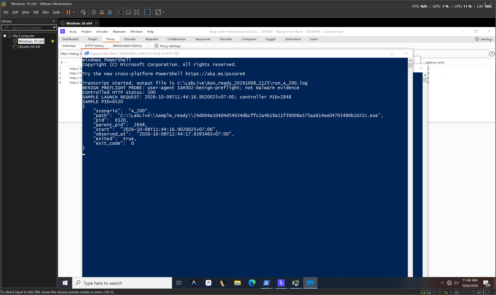
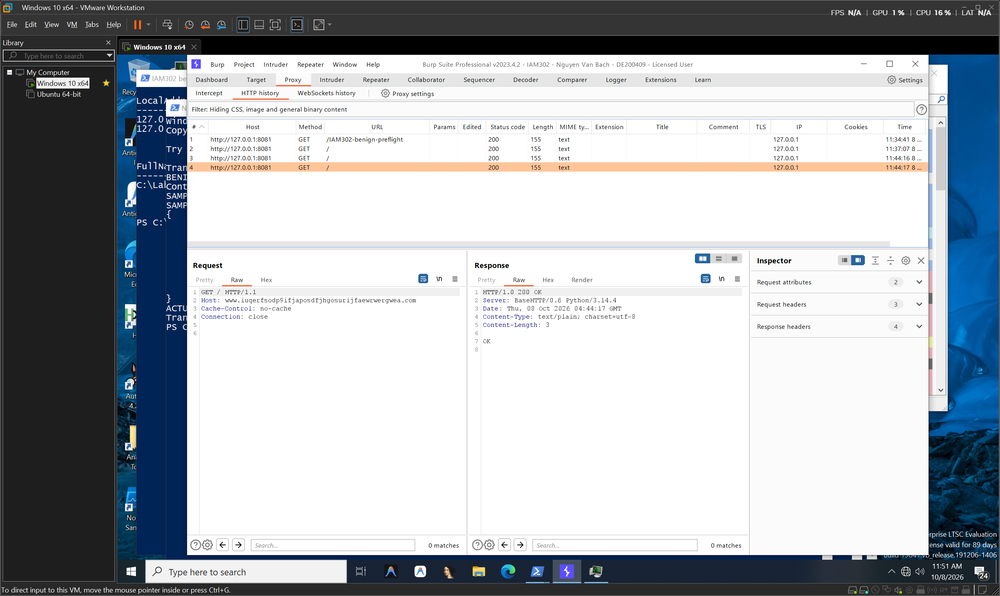
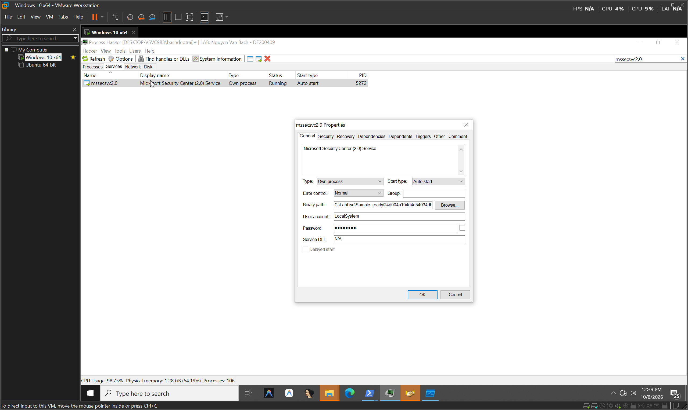
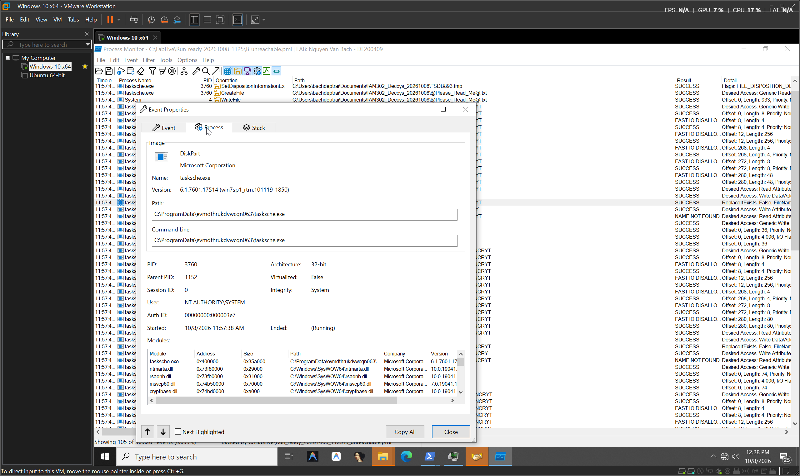
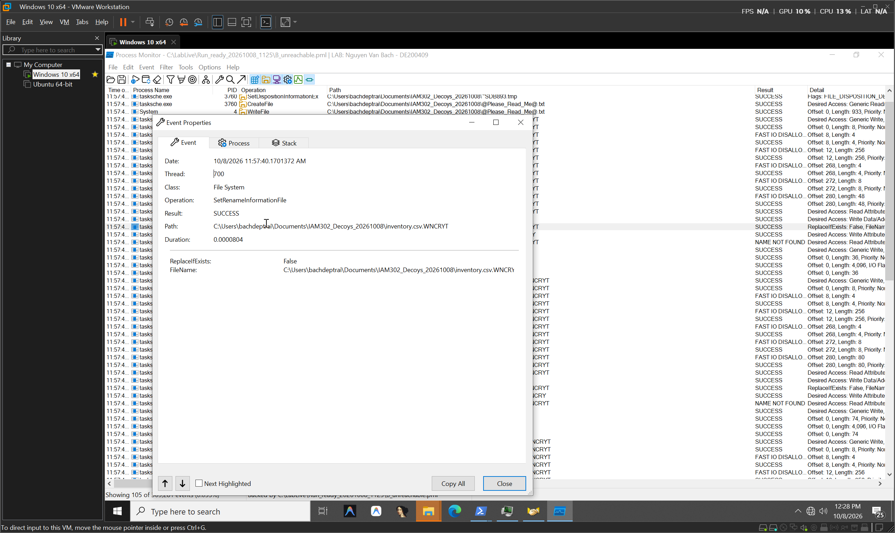
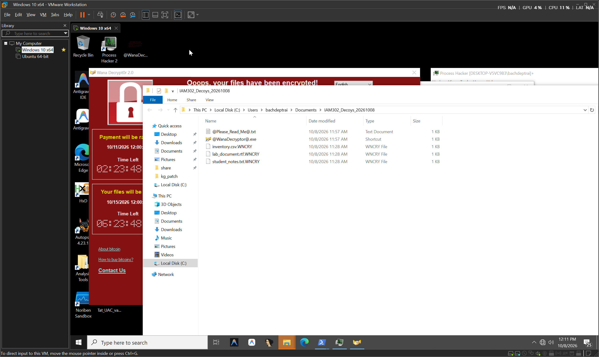
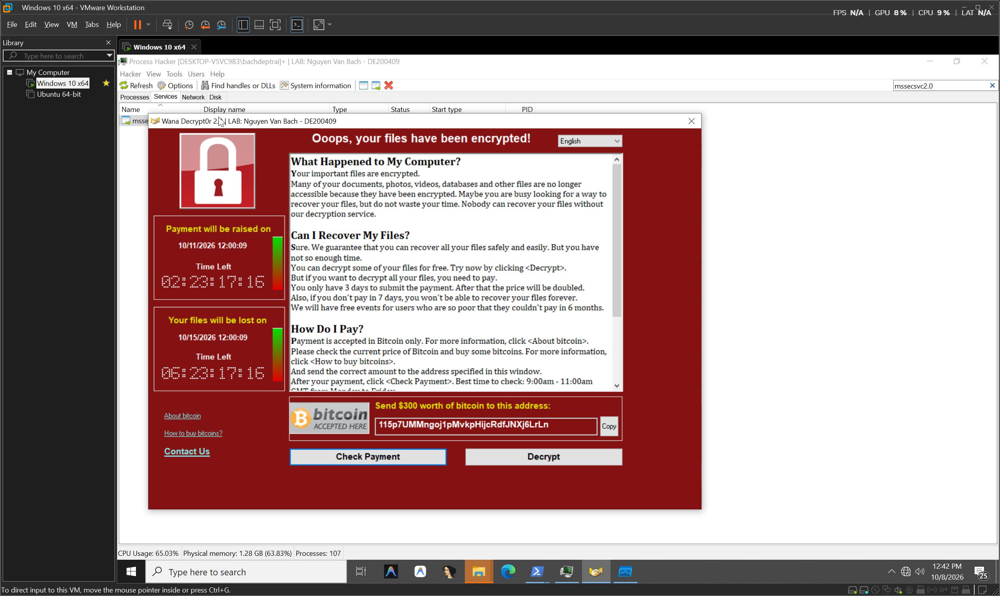
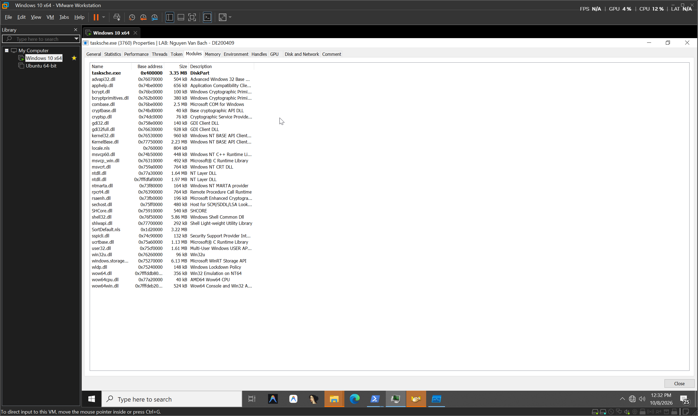

# WannaCry — Báo cáo hành vi

Hai lần chạy có kiểm soát đối chiếu phản ứng của mẫu khi endpoint kill-switch tới được hoặc không tới được; kết luận dựa trên Procmon, log và artifact, giới hạn trong cửa sổ thí nghiệm.

<a id="ket-luan-nhanh"></a>

- **A · Thoát sớm.** Responder trả HTTP 200; mẫu thoát `0`, ba decoy giữ nguyên, không có service mới.
- **B · Chuỗi tác động tiếp tục.** Hai service mới, payload được thả, ba decoy đổi thành `.WNCRY`, ransom artifacts xuất hiện.
- **Giới hạn · Không suy rộng.** Chưa chứng minh nhánh code nội bộ, persistence sau reboot hoặc mã hóa toàn máy.

[Kết quả đối chiếu](#doi-chieu) · [Sáu hành vi](#sau-chuong-hanh-vi) · [Kiểm chứng và nguồn](#kiem-chung)


<a id="doi-chieu"></a>

<details>
<summary>Bảng đối chiếu A/B và giới hạn kết luận</summary>

## 1. Kết luận nhanh

| Nội dung | Kịch bản A — responder cục bộ trả HTTP 200 | Kịch bản B — responder không tới được |
|---|---|---|
| Tiến trình gốc | PID `6520` | PID `5152` |
| Quan sát mạng | 1 Connect, 1 Send `100` byte, 1 Receive `155` byte, 1 Disconnect tới `127.0.0.1:80` | PID `5152` và `5272`: tổng 8 `TCP Reconnect`, 2 `TCP Disconnect`, đều tới `127.0.0.1:80` |
| Kết quả trong cửa sổ | PID `6520` thoát `0`; đúng ba decoy giữ nguyên path + SHA-256; không có service mới | Hai service mới; payload được thả; đúng ba decoy thử nghiệm đổi thành `.WNCRY`; ransom artifacts xuất hiện |
| Số bản ghi Procmon | `1,710` | `309,281` tổng; `271,958` bản ghi gán cho tập 15 PID; `37,323` bản ghi nền/loại trừ |
| Giới hạn kết luận | Log responder ghi HTTP 200, nhưng không có hook API chứng minh mẫu gọi API lấy/so sánh status code | Không có PCAP, không có quan sát reboot, không có traffic SMB bên ngoài do NIC bị tắt |

**Kết luận nhân quả hợp lý trong thí nghiệm:** trạng thái endpoint cục bộ thay đổi đồng thời với hai kết quả đối lập. A nhận dữ liệu rồi thoát; B không nhận phản hồi và tiếp tục chuỗi service–payload–mã hóa. Đây là bằng chứng thực nghiệm có đối chứng, **không** phải bằng chứng dịch ngược về câu lệnh nhánh nội bộ.

**Không được diễn giải quá mức:**

- A chỉ chứng minh **ba decoy đã đặt trước** không đổi và service list không có tên mới; không chứng minh toàn máy “không thay đổi”. PID `6520` vẫn có các ghi Registry ZoneMap ở `R442–R445`, `R447–R450`.
- B chỉ chứng minh **ba decoy** bị biến đổi; không chứng minh toàn bộ tệp trên máy bị phá hủy.
- `155` trong Procmon là độ dài của sự kiện `TCP Receive`, không phải `Content-Length` HTTP. Burp hiển thị response `Content-Length: 3`.
- “15 tiến trình được quy thuộc” gồm binary mẫu, payload và tiện ích Windows (`cmd.exe`, `attrib.exe`, `icacls.exe`, `cscript.exe`, `Conhost.exe`); không phải 15 binary mã độc độc lập.

</details>

<a id="sau-chuong-hanh-vi"></a>

## Sáu hành vi

<a id="hanh-vi-1"></a>

### Hành vi 1 — Nhánh mạng và kill switch

Endpoint tới được: mẫu nhận dữ liệu rồi thoát; không tới được: chuỗi service/payload tiếp tục.

<details>
<summary>Quan sát, cơ chế và bằng chứng</summary>

### Quan sát

- A: PID `6520` bắt đầu tại `11:44:16.9469731` (`R343`), Connect `127.0.0.1:80` (`R461`), Send `100` byte (`R464`), Receive `155` byte (`R475`), Disconnect (`R478`), rồi Exit status `0` tại `11:44:17.8391858` (`R479`).
- `mock_200.log` có bốn hit: ba preflight của harness, một request của mẫu tại `11:44:17`; responder ghi status `200`.
- Burp item 4 hiển thị `GET / HTTP/1.1`, Host domain kill-switch, response `HTTP/1.0 200 OK`, `Content-Length: 3`, forwarding host `127.0.0.1:8081`. Burp không có PID; attribution dùng timestamp cùng Procmon/log.
- B: PID `5152` có bốn `TCP Reconnect` (`R413`, `R498`, `R679`, `R769`) rồi Disconnect (`R770`). PID service `5272` lặp lại tại `R828`, `R1001`, `R1083`, `R1129`, rồi Disconnect (`R1130`).
- Cả 14 sự kiện mạng được quy thuộc của A+B đều nhắm loopback `127.0.0.1:80`; không có endpoint không-loopback trong tập này.

### Ý nghĩa

Khi responder cục bộ trả dữ liệu, mẫu thoát sạch. Khi endpoint không tới được, chuỗi thả payload tiếp tục. Phép thử hỗ trợ vai trò kill switch của điều kiện reachability.

### Cơ chế

`hosts` chuyển tên miền sang loopback; kết nối cổng 80 được chuyển tới responder kiểm soát ở `127.0.0.1:8081` trong cấu hình lab. Procmon ghi telemetry socket; responder/Burp ghi request/response HTTP.

### Liên kết nhân quả

Ở A, Receive kết thúc lúc `11:44:17.8177930`; Disconnect sau đó khoảng `8.48 ms`; Process Exit sau Disconnect khoảng `12.91 ms`. Ở B, Procmon ghi các reconnect rồi chuỗi service/payload xuất hiện. `Result=SUCCESS` trên `TCP Reconnect` nghĩa kernel xử lý request, không chứng minh kết nối ứng dụng thành công.

### Bằng chứng

- `network_verified.md`
- `A_verified_audit.md`
- `mock_200.log`, `run_A_200.log`, `run_B.log`



*Ảnh trên chứng minh transcript PowerShell hiển thị PID, trạng thái `exited` và `exit_code`; ảnh không phải cửa sổ Procmon. Các record TCP/Process nêu trên đến từ `A_200.csv`.*



*Ảnh Burp hỗ trợ request/response và forwarding host. Burp không có PID; việc tách ba preflight khỏi request của mẫu dựa trên timestamp, log và CSV.*

### Giới hạn

- HTTP 200 được responder/Burp quan sát; chưa chứng minh mẫu gọi API đọc status code hay nhánh riêng theo số `200`.
- `TCP Receive Length: 155` không phải `Content-Length`; response pane ghi `Content-Length: 3`.
- Không có PCAP hoặc ETW DNS; không chứng minh DNS packet trên dây.
- Một request kill-switch không phải beaconing, exfiltration hoặc C2.

</details>

<a id="hanh-vi-2"></a>

### Hành vi 2 — Dịch vụ Windows và persistence cấu hình

Hai service Auto/LocalSystem được cấu hình; chưa thử thực thi sau reboot.

<details>
<summary>Quan sát, cơ chế và bằng chứng</summary>

### Quan sát

Service count: baseline `261`, sau A `261` với tên mới `[]`, sau B `263` với đúng hai tên mới:

| Service | Start/Account | ImagePath quan sát |
|---|---|---|
| `mssecsvc2.0` | Auto (`Start=2`), `LocalSystem`, `Running` khi snapshot | `C:\LabLive\Sample_ready\24d004...exe -m security` |
| `evmdthrukdvwcqn063` | Auto (`Start=2`), `LocalSystem`, `Stopped` khi snapshot | `cmd.exe /c "C:\ProgramData\evmdthrukdvwcqn063\tasksche.exe"` |

Các anchor đã hiệu chỉnh: service đầu có `Start` ở `R772`, `ImagePath` ở `R774`, `ObjectName` ở `R777`; PID `5272` bắt đầu `R780`. Service thứ hai có `Start` ở `R1179`, `ImagePath` ở `R1181`, `ObjectName` ở `R1184`; PID `1152` bắt đầu `R1197`. System Event Log có hai Event ID `7045` tại `11:57:36` và `11:57:38`.

### Ý nghĩa

Cấu hình Auto + LocalSystem là persistence **được cấu hình** và tạo ngữ cảnh thực thi SYSTEM trong lần chạy hiện tại. Trạng thái `Stopped` của service thứ hai được báo cáo nguyên trạng, không suy đoán nguyên nhân.

### Cơ chế

Service Control Manager là broker: các `RegSetValue` dưới `HKLM\System\CurrentControlSet\Services\...` xuất hiện với actor `services.exe` PID `644`. Việc SCM thực hiện ghi Registry không tự nó là “bypass UAC”; bằng chứng chỉ cho thấy yêu cầu tạo service đã được SCM xử lý trong ngữ cảnh thí nghiệm.

### Liên kết nhân quả

PID `5152` đi trước việc tạo `mssecsvc2.0`; SCM khởi chạy PID `5272`. PID `6724` thả `C:\ProgramData\evmdthrukdvwcqn063\tasksche.exe`, sau đó SCM cấu hình service cùng tên, chạy `cmd.exe` PID `1152`, rồi `tasksche.exe` PID `3760`.

### Bằng chứng

- `persistence_verified.md`
- `service_events.log`
- `services_before.csv`, `services_A_200.csv`, `services_after.csv`



*Ảnh Process Hacker cho thấy `mssecsvc2.0`, Running, Auto, PID `5272`, LocalSystem tại thời điểm chụp. Ảnh không tự chứng minh cơ chế tạo service, hash binary hoặc persistence sau reboot.*

### Giới hạn

- Không reboot; chưa chứng minh hai service chạy lại thành công sau reboot.
- Run keys được kiểm tra chỉ gồm HKCU/HKLM `CurrentVersion\Run`; không gồm RunOnce/RunOnceEx. Hai log Run giống hash, delta Run = 0 trong đúng phạm vi đó.
- Scheduled Tasks không có task mới. Bốn task Defender đổi `Disabled` sang `Ready` nhưng provenance chưa xác định, không gán cho mẫu.
- Startup folders chưa được kiểm toán.

</details>

<a id="hanh-vi-3"></a>

### Hành vi 3 — Thả payload và chuỗi tiến trình

Payload được thả rồi chạy qua SCM; quan hệ nhân quả không phải một cây PPID liền mạch.

<details>
<summary>Quan sát, cơ chế và bằng chứng</summary>

### Quan sát

1. PID `5152` ghi `C:\Windows\tasksche.exe`: CreateFile `R1136` lúc `11:57:38.5925187`; WriteFile `R1137`, length `3,514,368`; Process Create `R1142`; PID `6724` start `R1143` với `C:\WINDOWS\tasksche.exe /i`.
2. PID `6724` tạo thư mục và `C:\ProgramData\evmdthrukdvwcqn063\tasksche.exe`, rồi service bridge khởi chạy PID `1152` và PID `3760`.
3. PID `3760` ghi `HKLM\SOFTWARE\WOW6432Node\WanaCrypt0r\wd = C:\ProgramData\evmdthrukdvwcqn063` tại `R1213`.
4. Trong working directory quan sát được `b.wnry`, `c.wnry`, `msg\m_*.wnry`, `r.wnry`, `s.wnry`, `t.wnry`, `taskdl.exe`, `taskse.exe`, `u.wnry`, `00000000.pky`, `00000000.eky`, `00000000.res`, `@WanaDecryptor@.exe`, batch/VBS, ransom note và shortcut.

### Ý nghĩa

Chuỗi thể hiện một dropper ban đầu, thành phần trung gian và payload chạy qua service. Tên file/extension hỗ trợ phân loại artifact; tên không đủ để khẳng định chức năng nội bộ như “wiper”, “elevation” hay thuật toán crypto.

### Cơ chế

Quan hệ PPID trực tiếp bị ngắt tại SCM. Cầu nối nhân quả dùng bốn dữ kiện: file được thả, `ImagePath` service trùng file, timestamp liền kề và Process Start đúng command line.

### Liên kết nhân quả

`5152 → 6724` là parent/child trực tiếp. `6724 → SCM/services.exe → 1152 → 3760` là causal lineage qua service, không phải một cây PPID liền mạch.

```text
powershell.exe (4872)                services.exe / SCM (644)
└─ mẫu (5152)                        ├─ mẫu -m security (5272)
   └─ tasksche.exe /i (6724)         └─ cmd.exe (1152)
                                       └─ tasksche.exe (3760)
                                          ├─ attrib.exe (5808)
                                          ├─ icacls.exe (2064)
                                          ├─ cmd.exe (3888)
                                          │  └─ cscript.exe (6096)
                                          └─ taskdl.exe (3 instance)
```

*Sơ đồ rút gọn để đọc parent/child; ba console host và số bản ghi từng PID nằm ở [bảng tiến trình](#bang-tien-trinh). Mũi tên causal qua SCM không phải quan hệ PPID trực tiếp.*

### Bằng chứng

- `B_verified_attribution.md`
- `B_verified_files.md`
- `B_verified_processes.json`



*Procmon Event Properties hiển thị `tasksche.exe`, path dưới `ProgramData`, PID `3760`, Parent PID `1152`, Session 0, Integrity System và user SYSTEM. Pane này không tự xác định hash/identity của parent hay toàn bộ causal lineage.*

### Giới hạn

- `Listdlls64.exe`, `handle64.exe`, Procmon và controller PowerShell là công cụ thí nghiệm, đã loại khỏi tập 15 PID.
- PID `1752` (`@WanaDecryptor@.exe`) xuất hiện lúc `12:00:10`, sau khi Procmon dừng `11:58:48`; không thuộc 15 PID trong capture B.
- Module được nạp chỉ chứng minh DLL có mặt trong address space, không chứng minh API cụ thể đã được gọi.

</details>

<a id="hanh-vi-4"></a>

### Hành vi 4 — `attrib` và `icacls`

Hai utility thay thuộc tính Hidden và DACL trong working directory, không phải toàn máy.

<details>
<summary>Quan sát, cơ chế và bằng chứng</summary>

### Quan sát

- PID `5808` start `R1721` lúc `11:57:38.8749271`, command `attrib +h .`.
- PID `2064` start `R1724` lúc `11:57:38.8796359`, command `icacls . /grant Everyone:F /T /C /Q`.
- PID `2064` thực hiện `SetSecurityFile` thành công trên `b.wnry` tại `R1844`, detail `Information: DACL`; đây là bằng chứng ACL thực sự được ghi, nhưng không chứa resultant ACL đầy đủ.
- Cả hai utility là child của `tasksche.exe` PID `3760`, chạy dưới `NT AUTHORITY\SYSTEM`; `Conhost.exe` tương ứng cũng nằm trong tập attributed.

### Ý nghĩa

`attrib +h .` đặt thuộc tính Hidden cho thư mục hiện hành: kỹ thuật che giấu artifact. `icacls ... /grant Everyone:F` sửa DACL, yêu cầu cấp Full control cho principal `Everyone` trên mục tiêu được duyệt.

### Cơ chế

- `+h` thêm file attribute Hidden cho `.`.
- `/grant Everyone:F` thêm quyền Full control; `/T` đệ quy; `/C` tiếp tục dù lỗi; `/Q` giảm output thành công.

| Thành phần lệnh | Đọc như thế nào? |
|---|---|
| `.` | Thư mục hiện hành của tiến trình; Process Start của hai utility ghi `C:\ProgramData\evmdthrukdvwcqn063\`, không phải toàn ổ C. |
| `Everyone` | Principal có SID phổ biến `S-1-1-0`; không có nghĩa toàn bộ đối tượng trên máy tự được cấp quyền. |
| `:F` | Full control cho mục cấp quyền đang thêm, không phải chuyển ownership. |
| `/grant` | Thêm quyền cấp cho principal; không đồng nghĩa xóa hoặc thay toàn bộ DACL. |
| `/T /C /Q` | Lần lượt: duyệt cây con, tiếp tục khi gặp lỗi, không in thông báo thành công. `/Q` không làm mất log Procmon. |

### Liên kết nhân quả

Hai utility được PID `3760` sinh ra ngay sau khi working directory/payload được thiết lập, nên có attribution tiến trình và thời gian rõ ràng.

### Bằng chứng

- `B_verified_attribution.md`
- `B_unreachable.csv`

### Giới hạn

- `icacls /grant` **không** lấy ownership, không chứng minh UAC bypass, không phải “universal allow” trên toàn máy.
- `SetSecurityFile` xác nhận ghi DACL, không cho biết ACL cuối cùng của mọi file.
- Không có lệnh xóa shadow copy/backup trong bằng chứng này; không map `icacls` sang **T1490 Inhibit System Recovery**.
- `attrib +h` map **T1564.001 Hide Artifacts: Hidden Files and Directories**, không phải T1027 Obfuscated/Compressed Files.

</details>

<a id="hanh-vi-5"></a>

### Hành vi 5 — Biến đổi đúng ba tệp decoy

Đúng ba decoy đổi path/hash, có header `WANACRY!`; chưa chứng minh thuật toán crypto cụ thể.

<details>
<summary>Quan sát, cơ chế và bằng chứng</summary>

### Quan sát

| Baseline | SHA-256 trước | Kết quả B | Kích thước sau (byte) / SHA-256 |
|---|---|---|---|
| `inventory.csv` | `B540FE2588CBAC784D685611B4E62FBF3DABDC03E5DEC0402A2C634756DF8EC4` | `inventory.csv.WNCRY` | `328`; `918F8918E203A7CA3124092C26E0C6F33F920FBEB7A9C67DAFC3705CA6D0D341` |
| `lab_document.rtf` | `C369AE736604EC60D7307134197A251CDD6472EEB15720E6EE5DF56ABBD01E13` | `lab_document.rtf.WNCRY` | `360`; `8F75DB912721C122753D48B06FE56F7A438BBBE8CCB5AA7BA61D4978449A99A8` |
| `student_notes.txt` | `0F855BDB7C9C9E29BA4BAC8E446C5190C8D1FF90784376AEECA759F5CCE1FBB1` | `student_notes.txt.WNCRY` | `360`; `D6BB94CD8914974A5D41404819E387297DE7CFD0B31E4230D311BA7DFC4FFE95` |

Ba rename `.WNCRYT → .WNCRY` thành công tại `R2617`, `R2638`, `R2659` vào `11:57:40.1701372`, `.1730523`, `.1813166`. Ba original sau đó được rename sang `C:\Windows\Temp\<N>.WNCRYT` tại `R279026`, `R279034`, `R279042` khoảng `11:58:40.951–.953`.

Mỗi artifact sau có magic bytes `WANACRY!` (`57 41 4E 41 43 52 59 21`). Offset `8..11` là uint32 little-endian `256`; offset `12..267` có block 256 byte.

### Ý nghĩa

Path đổi, hash đổi, container có header nhất quán và chuỗi ghi/rename được gán cho PID `3760`: đủ để kết luận ba decoy thử nghiệm đã bị biến đổi thành artifact `.WNCRY` trong kịch bản B.

### Cơ chế

Procmon ghi offset/length và rename; file đã sao chép được kiểm tra độc lập để đọc byte/header và tính SHA-256. `FAST IO DISALLOWED` được theo ngay bởi ghi IRP `SUCCESS`, là fallback I/O chứ không phải thất bại mã hóa.

### Liên kết nhân quả

PID `3760` tạo `.WNCRYT`, ghi nhiều vùng, rename sang `.WNCRY`, rồi di chuyển original ra Temp. Cùng lúc ransom note/shortcut được tạo trong thư mục decoy.

### Bằng chứng

- `B_verified_files.md`
- `handles_modules_decoys_verified.md`
- `decoys_before.csv`, `decoys_after_hashes.csv`
- `encrypted_decoys/`



*Ảnh cho thấy `SetRenameInformationFile` SUCCESS tại `11:57:40.1701372`: `.WNCRYT` được rename thành `.WNCRY`, `ReplaceIfExists: False`. Sự kiện rename không tự chứng minh thuật toán, API crypto, content transformation hay wipe.*



*Explorer cho thấy ba tên `.WNCRY`, ransom note và GUI phía sau. Hash/header từ artifact thực mới là bằng chứng nội dung; ảnh/extension riêng lẻ không đủ.*

### Giới hạn

- Procmon CSV không chứa raw bytes. Magic `WANACRY!` đến từ file artifact, không từ cột `WriteFile`.
- Giá trị `256` tại offset 8 chưa chứng minh RSA-2048, AES hay key size cụ thể.
- `decoys_before.csv` không lưu kích thước trước chạy; các write length `36`, `74`, `70` không được dùng làm baseline size.
- Ghi đè rồi di chuyển original sang Temp không chứng minh xóa an toàn hoặc mất khả năng phục hồi vĩnh viễn; chưa kiểm tra backup, VSS hay vùng đĩa chưa cấp phát.
- Chỉ ba decoy được kiểm chứng. Không suy rộng thành “mọi tệp người dùng” hay “toàn máy”.

</details>

<a id="hanh-vi-6"></a>

### Hành vi 6 — Ransom note, shortcut và GUI

Ransom artifacts xuất hiện; GUI được quan sát sau capture, không chứng minh thanh toán hay giải mã.

<details>
<summary>Quan sát, cơ chế và bằng chứng</summary>

### Quan sát

- `@Please_Read_Me@.txt`: `933` byte, SHA-256 `0E5ECE918132A2B1A190906E74BECB8E4CED36EEC9F9D1C70F5DA72AC4C6B92A`; nội dung đòi `$300` Bitcoin tới `115p7UMMngoj1pMvkpHijcRdfJNXj6LrLn`.
- `@WanaDecryptor@.exe.lnk`: `760` byte, SHA-256 `28006234CFCDADEC26647CA6690E215B26CBC04CCDAC5F015408D943BF24733B`.
- PID `3888` chạy `cmd.exe /c 116221791435459.bat` tại `R2279`; PID `6096` chạy `cscript.exe //nologo m.vbs` tại `R2425`.
- `@WanaDecryptor@.exe` được thả trong capture; process PID `1752` chỉ được quan sát sau capture. Snapshot muộn cho thấy module GUI MFC/RichEdit/Common Controls và handle tới working directory/font cache.

### Ý nghĩa

Ransom note, shortcut và GUI nhìn thấy là lớp tương tác/đòi tiền sau tác động dữ liệu. Các command shell/VBS tham gia dựng artifact giao diện; chức năng chi tiết chỉ được khẳng định ở mức file/command quan sát.

### Cơ chế

Batch được `cmd.exe` xử lý; `m.vbs` được Windows Script Host (`cscript.exe`) xử lý; shortcut trỏ người dùng tới decryptor GUI. Module GUI có mặt phù hợp với cửa sổ quan sát, nhưng không chứng minh từng API UI đã gọi.

### Liên kết nhân quả

Các process trong capture là hậu duệ của PID `3760`; file note/shortcut được tạo sau khi payload khởi chạy. PID GUI muộn mở cùng working directory, nối artifact trên đĩa với giao diện quan sát sau capture.

### Bằng chứng

- `B_verified_files.md`
- `handles_modules_decoys_verified.md`
- `preserve_current.log`



*Ảnh hiển thị thông báo mã hóa, hai deadline, yêu cầu `$300`, địa chỉ Bitcoin và nút payment/decrypt. Ảnh chỉ chứng minh ransom presentation; không chứng minh thanh toán, giải mã, executable identity hoặc service nền sở hữu cửa sổ.*



*Các DLL liên quan crypto như `bcrypt.dll`, `cryptsp.dll`, `rsaenh.dll` được nạp. DLL presence không chứng minh thuật toán hay API cụ thể đã chạy.*

### Giới hạn

- Không theo dõi thanh toán, giải mã hoặc liên lạc hạ tầng thật.
- Địa chỉ Bitcoin lấy từ ransom note/GUI; chưa xác minh quyền sở hữu hoặc giao dịch blockchain.
- Không gọi PID `1752` là thành viên của tập 15 PID capture B.

</details>

<a id="kiem-chung"></a>

## Kiểm chứng và nguồn

Mở phần cần đối chiếu; ảnh, bảng và log giữ nguyên phạm vi chứng cứ.

<a id="ho-so"></a>

<details>
<summary>Hồ sơ mẫu và phạm vi xuất bản</summary>

> **Cách đọc:** đọc mục 1 để nắm kết quả, mở từng chương để hiểu cơ chế, dùng timeline và nguồn để kiểm chứng. Markdown hỗ trợ mở/đóng nội dung bằng `<details>`; không chạy React/MDX hoặc live demo. Ảnh giữ nguyên các tệp PNG đã cung cấp, có khung VMware, không phải giao diện tương tác.

- **Học phần / người thực hiện:** IAM302 — Nguyen Van Bach, DE200409.
- **Mẫu:** `24d004a104d4d54034dbcffc2a4b19a11f39008a575aa614ea04703480b1022c.exe`
- **SHA-256:** `24D004A104D4D54034DBCFFC2A4B19A11F39008A575AA614EA04703480B1022C`
- **Máy quan sát:** Windows 10 build `19044`, tài khoản thí nghiệm `DESKTOP-V5VC9B3\bachdeptrai`.
- **Phạm vi:** hai lần chạy có kiểm soát ngày `2026-10-08` (UTC+7); Procmon, transcript PowerShell, log responder, chênh lệch service/task/Run key, Event ID 7045, Sysinternals Handle/ListDLLs và ba tệp decoy.

> **Phạm vi xuất bản:** sửa `README.md` chỉ thay tài liệu trên Git repository/GitHub. SPA production hiện không có route hay renderer MD/MDX cho README; nội dung này không tự xuất hiện trong SPA nếu ứng dụng không được bổ sung chức năng đó.

</details>

<a id="muc-luc"></a>

<details>
<summary>Mục lục đầy đủ</summary>

## Mục lục

1. [Kết luận nhanh](#ket-luan-nhanh)
2. [Cách đọc chứng cứ](#cach-doc-chung-cu)
3. [Khái niệm và thiết kế phép thử](#khai-niem-va-thiet-ke)
4. [Sáu chương hành vi](#sau-chuong-hanh-vi)
   1. [Nhánh mạng và kill switch](#hanh-vi-1)
   2. [Dịch vụ Windows và persistence cấu hình](#hanh-vi-2)
   3. [Thả payload và chuỗi tiến trình](#hanh-vi-3)
   4. [`attrib` và `icacls`](#hanh-vi-4)
   5. [Biến đổi ba tệp decoy](#hanh-vi-5)
   6. [Ransom note, shortcut và GUI](#hanh-vi-6)
5. [Dòng thời gian đã hiệu chỉnh](#dong-thoi-gian)
6. [Bảng tiến trình](#bang-tien-trinh)
7. [Command tokens](#command-tokens)
8. [IOC](#ioc)
9. [MITRE ATT&CK](#mitre)
10. [Biên kiểm toán](#bien-kiem-toan)
11. [Chín câu hỏi học phần](#chin-cau-hoi)
12. [Nguồn và liên kết tham khảo](#nguon-tham-khao)

</details>

<a id="cach-doc-chung-cu"></a>

<details>
<summary>Quy ước chứng cứ và CSV record</summary>

## 2. Cách đọc chứng cứ

| Nhãn | Ý nghĩa |
|---|---|
| **Quan sát** | Có trực tiếp trong file/log/ảnh được dẫn nguồn. |
| **Diễn giải** | Ý nghĩa hợp lý của quan sát, vẫn tách khỏi dữ kiện gốc. |
| **Cơ chế** | Windows xử lý thao tác như thế nào; không đồng nghĩa đã hook được API. |
| **Liên kết nhân quả** | Chuỗi thời gian, parent/child, file path hoặc cấu hình service nối các sự kiện. |
| **Giới hạn** | Điều dữ liệu hiện có không chứng minh. |

**Quy ước record:** mọi số `R...` trong báo cáo này là **1-based data record index, không tính dòng header**, được đọc bằng `csv.DictReader`. Quy ước này đã hiệu chỉnh sai lệch +1 trong một số báo cáo trung gian. Trường CSV có newline nhúng; không dùng số dòng vật lý của file văn bản làm record index.

</details>

<a id="khai-niem-va-thiet-ke"></a>

<details>
<summary>Khái niệm và thiết kế phép thử</summary>

## 3. Khái niệm và thiết kế phép thử

- **Kill switch:** điều kiện môi trường khiến chương trình ngừng hoặc tiếp tục. Trong phép thử, domain `www.iuqerfsodp9ifjaposdfjhgosurijfaewrwergwea.com` được ánh xạ về loopback. Đây không phải C2 đã xác nhận.
- **Dropper/payload:** tiến trình ban đầu ghi thành phần khác xuống đĩa rồi kích hoạt chúng. Tên switch `-m security` và `/i` được quan sát như token dòng lệnh; ý nghĩa nội bộ của từng switch chưa được chứng minh bằng hook API hoặc dịch ngược trong bộ chứng cứ này.
- **Persistence cấu hình:** service có `Start=2`/Auto tạo điều kiện chạy khi boot. Khả năng sống sót và chạy thành công sau reboot chỉ được xác nhận bằng một phép thử reboot; phép thử đó **không được thực hiện**.
- **Decoy:** ba tệp thử nghiệm có hash baseline, đặt tại `C:\Users\bachdeptrai\Documents\IAM302_Decoys_20261008`. Chúng cho phép kết luận hẹp, kiểm chứng được.
- **Attribution:** một bản ghi được gán vào chuỗi hành vi dựa trên PID, parent, command line và cầu nối SCM. “Attributed” không biến mọi executable Windows trong chuỗi thành malware binary.
- **Ảnh chụp:** ảnh hỗ trợ bối cảnh nhìn thấy. CSV/log/hash là nguồn định lượng. Ảnh không thay thế sự kiện thô.
- **Service và chương trình thông thường:** chương trình thường được người dùng mở trong phiên đăng nhập; service có cấu hình và vòng đời do SCM quản lý, có thể chạy khi chưa có người đăng nhập. `services.exe` là tiến trình quản lý dịch vụ, không phải bản thân payload.
- **LocalSystem:** tài khoản dịch vụ có đặc quyền cao trên máy cục bộ. Thấy token SYSTEM giải thích phạm vi quyền thực thi, không chứng minh mọi tệp đều truy cập được. Tạo service cần quyền thích hợp đối với SCM; đăng ký service không tự vượt qua kiểm soát quyền.
- **DACL và ACL:** danh sách quyền gắn với đối tượng tệp/thư mục. Windows đối chiếu các mục cho phép/từ chối với token tiến trình. Full control trong một mục cấp quyền không xóa mọi mục từ chối, khóa chia sẻ hoặc cơ chế bảo vệ khác.

</details>

<a id="dong-thoi-gian"></a>

<details>
<summary>Dòng thời gian đã hiệu chỉnh</summary>

## 5. Dòng thời gian đã hiệu chỉnh

| Thời gian cục bộ | Kịch bản/record | Sự kiện quan sát |
|---|---:|---|
| `11:44:16.9469731` | A `R343` | PID `6520` Process Start. |
| `11:44:17.7597933` → `.8262714` | A `R461/R464/R475/R478` | Connect, Send `100`, Receive `155`, Disconnect loopback:80. |
| `11:44:17.8391858` | A `R479` | PID `6520` Exit status `0`. |
| `11:57:33.5614500` | B `R326` | PID `5152` Process Start. |
| `11:57:34.5747453` → `11:57:36.0904549` | B `R413/R498/R679/R769/R770` | PID `5152`: 4 reconnect rồi disconnect. |
| `11:57:36.0995946` | B `R772` | SCM ghi `Start=2` cho `mssecsvc2.0`. |
| `11:57:36.1196578` | B `R780` | PID `5272` service instance Process Start. |
| `11:57:36.8874067` → `11:57:38.5847171` | B `R828/R1001/R1083/R1129/R1130` | PID `5272`: 4 reconnect rồi disconnect. |
| `11:57:38.5925187` → `.6064300` | B `R1136/R1137/R1142/R1143` | Ghi `C:\Windows\tasksche.exe`, tạo và bắt đầu PID `6724`. |
| `11:57:38.6785954` | B `R1179` | SCM ghi `Start=2` cho service `evmdthrukdvwcqn063`. |
| `11:57:38.6866410` | B `R1197` | PID `1152` `cmd.exe` Process Start qua SCM. |
| `11:57:38.7258752` | B `R1209` | PID `3760` `tasksche.exe` Process Start. |
| `11:57:38.7612232` | B `R1213` | Ghi Registry `WanaCrypt0r\wd`. |
| `11:57:38.8749271/.8796359` | B `R1721/R1724` | `attrib` và `icacls` Process Start. |
| `11:57:39.2573132` | B `R1844` | PID `2064` `SetSecurityFile` DACL trên `b.wnry`: SUCCESS. |
| `11:57:39.9847610` | B `R2279` | Batch runner PID `3888` start. |
| `11:57:40.0825587` | B `R2425` | `cscript.exe` PID `6096` start. |
| `11:57:40.1701372/.1730523/.1813166` | B `R2617/R2638/R2659` | Ba `.WNCRYT` rename sang `.WNCRY`. |
| `11:58:40.9514099/.9523913/.9531109` | B `R279026/R279034/R279042` | Ba original rename sang Temp. |
| `11:58:47.7389115` | B capture end | Kết thúc cửa sổ CSV; PID `3760/5272` còn qua cuối trace. |
| `12:00:10` | log muộn | PID `1752` GUI xuất hiện sau capture. |

</details>

<a id="bang-tien-trinh"></a>

<details>
<summary>15 tiến trình được quy thuộc</summary>

## 6. Bảng 15 tiến trình được quy thuộc trong capture B

| PID | Image/command quan sát | PPID | Bản ghi | Vai trò chứng cứ hẹp |
|---:|---|---:|---:|---|
| 5152 | `24d004...exe` | 4872 | 32 | Mẫu được harness khởi chạy. |
| 5272 | `24d004...exe -m security` | 644 | 60 | Instance do SCM khởi chạy cho `mssecsvc2.0`. |
| 6724 | `C:\WINDOWS\tasksche.exe /i` | 5152 | 8 | Child trực tiếp; file/service setup quan sát được. |
| 1152 | `cmd.exe /c "...\tasksche.exe"` | 644 | 11 | Wrapper đúng ImagePath service thứ hai. |
| 3760 | `C:\ProgramData\...\tasksche.exe` | 1152 | 271,536 | Actor chính của file/registry trong capture. |
| 5808 | `attrib.exe +h .` | 3760 | 7 | Utility đặt Hidden. |
| 2064 | `icacls.exe . /grant Everyone:F /T /C /Q` | 3760 | 216 | Utility sửa ACL. |
| 2952 | `Conhost.exe ...` | 5808 | 9 | Console host của `attrib`. |
| 6992 | `Conhost.exe ...` | 2064 | 8 | Console host của `icacls`. |
| 3888 | `cmd.exe /c 116221791435459.bat` | 3760 | 20 | Batch runner. |
| 3472 | `Conhost.exe ...` | 3888 | 9 | Console host của batch. |
| 6096 | `cscript.exe //nologo m.vbs` | 3888 | 27 | Windows Script Host chạy VBS. |
| 6776 | `taskdl.exe` | 3760 | 5 | Child instance 1; chức năng nội bộ chưa chứng minh. |
| 3252 | `taskdl.exe` | 3760 | 5 | Child instance 2; chức năng nội bộ chưa chứng minh. |
| 1532 | `taskdl.exe` | 3760 | 5 | Child instance 3; chức năng nội bộ chưa chứng minh. |
| **Tổng** |  |  | **271,958** | **87.93% của 309,281 record nguồn.** |

`services.exe` PID `644` là broker OS, không nằm trong tập 15; analyst tools cũng bị loại. `271,958` là số record quy thuộc cho lineage, không phải số “hành vi độc hại” độc lập.

</details>

<a id="command-tokens"></a>

<details>
<summary>Command tokens</summary>

## 7. Command tokens quan sát được

| Command/token | Điều chứng minh được | Điều không được suy diễn |
|---|---|---|
| `24d004...exe -m security` | Command line của service instance. | `-m` có nghĩa chính xác gì trong code. |
| `C:\WINDOWS\tasksche.exe /i` | Command line child PID `6724`. | `/i` chắc chắn là “install” nếu chưa dịch ngược/hook. |
| `cmd.exe /c "...\tasksche.exe"` | CMD thực thi command rồi kết thúc. | SCM tự động bypass UAC. |
| `attrib +h .` | Thêm thuộc tính Hidden cho thư mục hiện hành. | Mã hóa/obfuscate nội dung. |
| `icacls . /grant Everyone:F /T /C /Q` | Yêu cầu Full control theo target, duyệt đệ quy, tiếp tục lỗi, quiet; `SetSecurityFile` xác nhận ít nhất một DACL được ghi. | Lấy ownership; cho phép toàn máy; xóa backup/recovery. |
| `cmd.exe /c 116221791435459.bat` | Chạy batch được quan sát. | Nội dung mọi nhánh batch nếu chưa đối chiếu file. |
| `cscript.exe //nologo m.vbs` | Chạy VBS không banner. | Mọi API hoặc mục đích bên trong script. |

</details>

<a id="ioc"></a>

<details>
<summary>IOC có căn cứ</summary>

## 8. Chỉ số xâm phạm (IOC) có căn cứ

| Loại | Giá trị | Phạm vi/ghi chú |
|---|---|---|
| SHA-256 mẫu | `24D004A104D4D54034DBCFFC2A4B19A11F39008A575AA614EA04703480B1022C` | Identity file thí nghiệm. |
| Domain kill-switch | `www.iuqerfsodp9ifjaposdfjhgosurijfaewrwergwea.com` | Ánh xạ loopback trong lab; không phải C2 đã chứng minh. |
| Service | `mssecsvc2.0` | Display name `Microsoft Security Center (2.0) Service`. |
| Service/thư mục | `evmdthrukdvwcqn063` | Tên service và working directory quan sát được. |
| Path | `C:\Windows\tasksche.exe` | Stage được PID `5152` ghi. |
| Path | `C:\ProgramData\evmdthrukdvwcqn063\` | Working directory. |
| Registry | `HKLM\SOFTWARE\WOW6432Node\WanaCrypt0r\wd` | Giá trị trỏ working directory. |
| Extension/magic | `.WNCRY`; `WANACRY!` | Xác minh trên đúng ba artifact. |
| Ransom files | `@Please_Read_Me@.txt`; `@WanaDecryptor@.exe`; `.lnk` | File/artifact quan sát được. |
| Bitcoin address | `115p7UMMngoj1pMvkpHijcRdfJNXj6LrLn` | Trích từ ransom note/GUI; ownership chưa xác minh. |

</details>

<a id="mitre"></a>

<details>
<summary>Đối chiếu MITRE ATT&CK</summary>

## 9. Đối chiếu MITRE ATT&CK có kiểm soát

| Technique | Mapping | Bằng chứng tại chỗ | Mức tin cậy |
|---|---|---|---|
| [T1543.003](https://attack.mitre.org/techniques/T1543/003/) | Create or Modify System Process: Windows Service | Hai service mới, `Start=2`, ImagePath, Event ID 7045. | Cao; persistence sau reboot chưa thử. |
| [T1486](https://attack.mitre.org/techniques/T1486/) | Data Encrypted for Impact | Ba decoy đổi path/hash, container `.WNCRY`, header artifact. | Cao trong phạm vi ba decoy. |
| [T1564.001](https://attack.mitre.org/techniques/T1564/001/) | Hide Artifacts: Hidden Files and Directories | `attrib +h .`. | Cao. |
| [T1222.001](https://attack.mitre.org/techniques/T1222/001/) | File and Directory Permissions Modification: Windows File and Directory Permissions Modification | `icacls ... /grant Everyone:F ...` và `SetSecurityFile` DACL success. | Cao cho ACL change; không phải ownership. |
| [T1059.003](https://attack.mitre.org/techniques/T1059/003/) | Command and Scripting Interpreter: Windows Command Shell | Hai command `cmd.exe /c ...`. | Cao. |
| [T1059.005](https://attack.mitre.org/techniques/T1059/005/) | Command and Scripting Interpreter: Visual Basic | `cscript.exe //nologo m.vbs`. | Cao. |
| [T1036.004](https://attack.mitre.org/techniques/T1036/004/) | Masquerading: Masquerade Task or Service | Service display name `Microsoft Security Center (2.0) Service` không trùng image mẫu. | Trung bình; “ý định đánh lừa” là diễn giải. |

**Không map trong báo cáo:** T1490 từ `icacls`; T1027 từ `attrib`; C2/Web Protocol từ một kill-switch request; UAC bypass từ SCM; SMB propagation khi không có traffic SMB quan sát được. `T1204.002 User Execution` là hành động harness trong thí nghiệm, không phải kỹ thuật adversary được chứng minh ở đây.

</details>

<a id="bien-kiem-toan"></a>

<details>
<summary>Biên kiểm toán và độ tin cậy</summary>

## 10. Biên kiểm toán và độ tin cậy

1. `verification.log` đã pass 5 nhóm: checksum artifact; record count `1,710/309,281`; ba hash A; ba header/hash B; 15 PID và tổng `271,958`.
2. Procmon CSV chứa metadata I/O, không chứa raw bytes. Header và SHA-256 lấy từ file artifact riêng.
3. Không có PCAP, DNS ETW, debugger, API hooking hoặc memory trace. DNS, status parsing, thuật toán crypto và code branch nội bộ chưa được chứng minh.
4. NIC bị disable ở B. Không thấy external SMB/C2/exfiltration không đồng nghĩa binary không có capability đó.
5. A/B dùng loopback và responder tổng hợp. Responder không phải hạ tầng threat actor.
6. Ba preflight của harness bị tách khỏi một request của mẫu. Không nhập hoạt động analyst vào attribution malware.
7. Ảnh chụp là evidence hỗ trợ UI. Full-frame không đồng nghĩa mọi chi tiết trong ảnh đều đã được định lượng.
8. Handle log lúc `11:57` dùng `handle <PID>` nên là string search, không phải per-process dump. Snapshot `12:35:55` mới dùng `handle -p <PID>`.
9. DLL presence không chứng minh exported API đã chạy; DLL absence cũng không chứng minh tuyệt đối thiếu capability.
10. PID `1752` và snapshot handle/module muộn nằm ngoài capture B; được ghi nhãn riêng.
11. Không reboot, không kiểm toán Startup folders, RunOnce/RunOnceEx, Task XML, thanh toán, giải mã hoặc phục hồi.
12. Không có bằng chứng “toàn máy bị mã hóa”; chỉ ba decoy có baseline/hash đối chiếu.
13. Kịch bản A vẫn có ghi ZoneMap; kết luận A được giới hạn ở exit/service delta/ba decoy, không gọi toàn hệ thống bất biến.

</details>

<a id="chin-cau-hoi"></a>

<details>
<summary>Chín câu hỏi học phần</summary>

## 11. Trả lời chín câu hỏi học phần

1. **Hành vi ngay sau thực thi?**
   Mẫu thực hiện kết nối TCP tới endpoint loopback đại diện domain kill-switch. A có `TCP Receive` length `155` rồi thoát `0`; B có reconnect nhưng không có `TCP Receive` được ghi nhận, sau đó chuỗi hành vi tiếp tục.

2. **Hệ điều hành thay đổi thế nào?**
   Trong A có các ghi ZoneMap nhưng không có service mới và ba decoy giữ nguyên. Trong B: hai service mới, working directory/payload mới, Registry `WanaCrypt0r\wd`, DACL/Hidden attribute, ba decoy đổi thành `.WNCRY`, ransom note/shortcut/GUI. Không khẳng định thay đổi toàn hệ thống ngoài capture.

3. **Tệp hoặc tiến trình nào sinh ra?**
   Các stage `C:\Windows\tasksche.exe`, `C:\ProgramData\evmdthrukdvwcqn063\...`, ransom artifacts; 15 PID attributed được liệt kê ở [mục 6](#bang-tien-trinh). Nhiều PID là utility Windows, không phải 15 malware binary. PID GUI `1752` đến sau capture.

4. **Có persistence sau reboot?**
   Hai service Auto/LocalSystem tạo **cấu hình persistence**. Không có reboot test, nên chưa xác nhận thực thi sau reboot.

5. **Kết nối IP/domain nào?**
   Domain kill-switch nêu trên được ánh xạ tới `127.0.0.1`; toàn bộ 14 sự kiện mạng attributed nhắm `127.0.0.1:80`. Không có endpoint công cộng trong trace attributed.

6. **Giao thức và mục đích?**
   Procmon chứng minh TCP. Responder/Burp/log hỗ trợ một request HTTP ở A dùng để kiểm tra endpoint. Không có PCAP/DNS API trace; không gọi đây là C2.

7. **Điều kiện môi trường làm hành vi đổi thế nào?**
   Responder tới được: thoát sớm, ba decoy nguyên hash, không service mới. Responder không tới được: service, payload và biến đổi ba decoy xuất hiện. Cơ chế code branch chính xác chưa được dịch ngược trong bằng chứng này.

8. **IOC cốt lõi?**
   SHA-256 mẫu, domain kill-switch, hai service, working directory, `tasksche.exe`, Registry `WanaCrypt0r\wd`, `.WNCRY`, `WANACRY!`, ransom files và Bitcoin address; xem [mục 8](#ioc).

9. **MITRE ATT&CK nào được hỗ trợ?**
   T1543.003, T1486, T1564.001, T1222.001, T1059.003, T1059.005; T1036.004 ở mức trung bình. Các mapping bị loại được nêu rõ tại [mục 9](#mitre).

</details>

<a id="nguon-tham-khao"></a>

<details>
<summary>Nguồn, lệnh tái kiểm tra và tài liệu chuẩn</summary>

## 12. Nguồn và liên kết tham khảo

### Hồ sơ kiểm toán cục bộ

Các tệp dưới đây nằm trong thư mục hồ sơ gốc `D:\FPT University\FA26\IAM302\live_analysis\Run_ready_20261008_1125\`, ngoài repository SPA. Tên tệp là nguồn để đối chiếu tại máy phân tích, **không phải liên kết tải trên GitHub**. Báo cáo trích sự kiện và ảnh cần đọc tại chỗ; không tự công khai toàn bộ log, file thực thi hoặc tệp bị mã hóa.

- Audit kịch bản A — `A_verified_audit.md`
- Attribution tiến trình B — `B_verified_attribution.md`
- File audit B — `B_verified_files.md`
- Network audit A/B — `network_verified.md`
- Persistence/Registry audit — `persistence_verified.md`
- Handle, module và encrypted decoy audit — `handles_modules_decoys_verified.md`
- Verification log — `verification.log`
- Machine-readable process set — `B_verified_processes.json`
- Procmon A — `A_200.csv` · Procmon B — `B_unreachable.csv`

### Tái kiểm tra tại máy giữ hồ sơ

Lệnh dưới chỉ chạy script kiểm tra checksum/count/hash đã có, không chạy mẫu:

```powershell
py "D:\FPT University\FA26\IAM302\live_analysis\Run_ready_20261008_1125\verify_evidence.py"
```

Kết quả mong đợi: `STATUS: OK`. Để kiểm tra một record được dẫn trong timeline, dùng `csv.DictReader`, đếm từ 1 sau header; đối chiếu cả PID, Operation, timestamp và Path, không chỉ riêng số thứ tự.

### Tài liệu chuẩn

- [MITRE ATT&CK Enterprise techniques](https://attack.mitre.org/techniques/enterprise/)
- [Microsoft: attrib](https://learn.microsoft.com/windows-server/administration/windows-commands/attrib)
- [Microsoft: icacls](https://learn.microsoft.com/windows-server/administration/windows-commands/icacls)
- [Microsoft: Service start type](https://learn.microsoft.com/windows/win32/api/winsvc/nf-winsvc-changeserviceconfiga)
- [Sysinternals Procmon](https://learn.microsoft.com/sysinternals/downloads/procmon)
- [Sysinternals Handle](https://learn.microsoft.com/sysinternals/downloads/handle)

---

**Trạng thái xác minh:** `verification.log` kết thúc bằng `ALL FORENSIC CHECKS PASSED SUCCESSFULLY (STATUS: OK)`. Trạng thái đó xác nhận checksum/count/hash/PID đã kiểm tra; không mở rộng phạm vi vượt quá các giới hạn ở [mục 10](#bien-kiem-toan).

</details>
