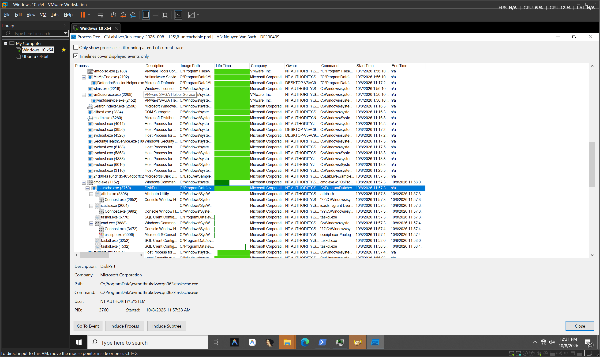
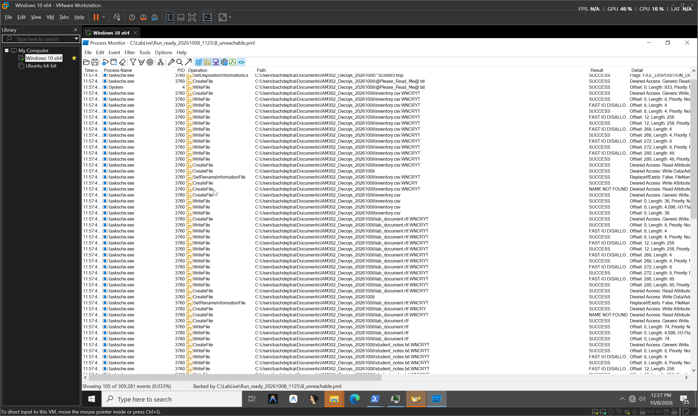
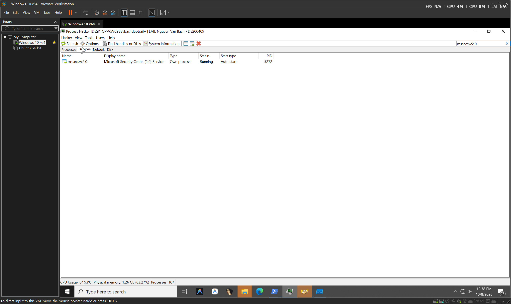
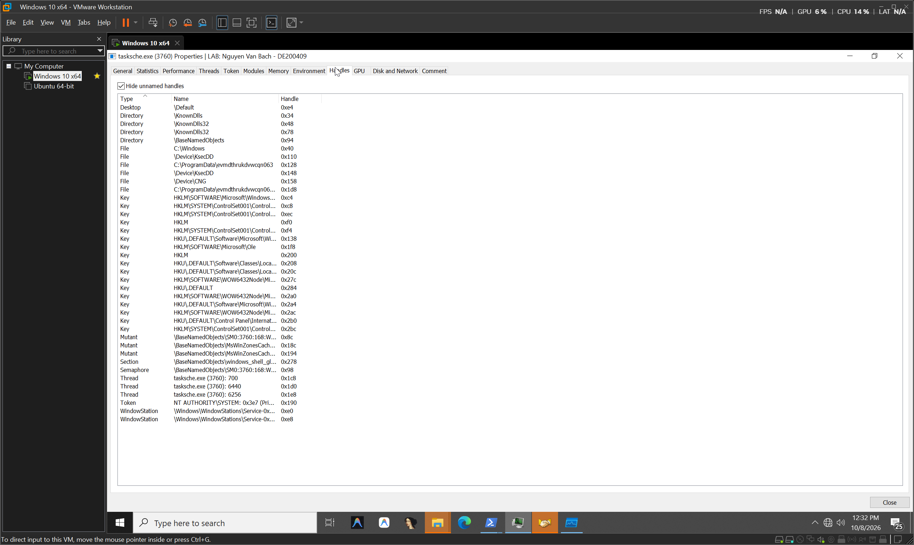

# 🛡️ BÁO CÁO ĐIỀU HÀNH & KỸ THUẬT: PHÂN TÍCH HÀNH VI RANSOMWARE WANNACRY
> **Tài liệu toàn diện: Tóm tắt 30 giây cho Ban Lãnh đạo (TL;DR) & Báo cáo Kỹ thuật 15 Yêu cầu**  
> *Được thực hiện qua phân tích động cô lập trên môi trường lab thực tế bởi: Nguyen Van Bach (DE200409)*

[](https://wannacry-executive-dashboard.vercel.app)
[](https://github.com/nimosocute/wannacry-executive-dashboard)
[](https://attack.mitre.org)
[](https://fpt.edu.vn)

---

## ⚡ PHẦN I: TÓM TẮT ĐIỀU HÀNH (EXECUTIVE BRIEFING — ĐỌC TRONG 30 GIÂY)
*Dành cho Ban Giám đốc và Lãnh đạo không chuyên kỹ thuật (Non-technical / TL;DR Friendly).*

| Chỉ số rủi ro | Kịch bản A (Có công tắc hủy) | Kịch bản B (Bị tấn công thực tế) | Ý nghĩa đối với Doanh nghiệp |
| :--- | :---: | :---: | :--- |
| **Tình trạng hệ thống** | 🟢 **AN TOÀN 100%** | 🔴 **TÊ LIỆT TOÀN BỘ** | Mã độc có tính năng tự hủy nếu đáp ứng điều kiện mạng. |
| **Thời gian phá hoại** | `0.89 giây` (Tự tắt) | `< 3.0 giây` (Mã hóa xong) | Tốc độ lây lan cực nhanh, con người không kịp trở tay. |
| **Thiệt hại tài chính** | **0 USD** | **$300 USD / máy** (bằng Bitcoin) | Sẽ tăng gấp đôi ($600) sau 3 ngày; mất dữ liệu vĩnh viễn sau 7 ngày. |
| **Tệp dữ liệu bị khóa** | **0%** (Tệp nguyên vẹn) | **100%** (Đổi đuôi `.WNCRY`) | Mất toàn bộ tài liệu Word, Excel, hợp đồng, kế toán. |
| **Tự khởi động ngầm** | ❌ Không | ⚠️ **2 Dịch vụ Windows bí mật** | Khởi động lại máy tính vẫn tiếp tục bị nhiễm mã độc. |

### 📌 Điểm mấu chốt sếp cần biết:
1. **WannaCry là gì?** Là mã độc tống tiền tự động. Khi lọt vào máy tính, nó âm thầm khóa toàn bộ tài liệu quan trọng và đòi tiền chuộc 300$ bằng Bitcoin để mở khóa.
2. **"Công tắc hủy" (Kill-Switch) thần kỳ:** Trước khi phá hoại, mã độc sẽ bí mật gửi yêu cầu HTTP kiểm tra một tên miền bí mật.
   - Nếu tên miền này **có phản hồi HTTP 200 OK**: Mã độc nhận định môi trường đang bị chuyên gia bảo mật phân tích -> **Nó lập tức tự hủy và thoát trong 0.89 giây** (Kịch bản A).
   - Nếu tên miền **không phản hồi (mất mạng)**: Nó lập tức kích hoạt bộ máy phá hủy, khóa sạch dữ liệu và thay hình nền tống tiền (Kịch bản B).
3. **Bài học sống còn cho công ty:** Không chặn bừa bãi tên miền kill-switch nội bộ, và phải vá lỗ hổng Windows ngay lập tức.

### 🎯 Ba Hành Động Đề Xuất Cho Ban Giám Đốc (Action Items)
- [x] **Hành động 1 (Khẩn cấp):** Phê duyệt cho bộ phận IT rà soát và cài đặt ngay bản vá **MS17-010** trên toàn bộ máy tính Windows trong công ty.
- [x] **Hành động 2:** Khóa cổng chia sẻ file nội bộ (`SMB Port 445`) không cho phép truy cập trực tiếp từ Internet vào mạng công ty.
- [x] **Hành động 3:** Cấu hình sao lưu (Backup) dữ liệu quan trọng ra ổ cứng rời / đám mây độc lập định kỳ hàng tuần (Quy tắc 3-2-1).

---

## 🔬 PHẦN II: BÁO CÁO KỸ THUẬT TOÀN DIỆN (FULL TECHNICAL REPORT)
*Dành cho Trưởng phòng Bảo mật, Chuyên viên SOC và Hội đồng Chấm thi (Đáp ứng đầy đủ 15 Yêu cầu thực hành bổ sung).*

## 1. Tổng quan & Thiết lập môi trường cách ly (Execution Context & Containment)

### 1.1 Thông tin mẫu mã độc & Danh tính thực nghiệm
- **Tên tệp gốc:** `24d004a104d4d54034dbcffc2a4b19a11f39008a575aa614ea04703480b1022c.exe`
- **Đường dẫn trong máy ảo:** `C:\LabLive\Sample_ready\24d004a104d4d54034dbcffc2a4b19a11f39008a575aa614ea04703480b1022c.exe`
- **Khối lượng:** 3,514,368 bytes (PE32 executable, x86)
- **SHA-256 xác minh:** `24D004A104D4D54034DBCFFC2A4B19A11F39008A575AA614EA04703480B1022C`
- **Tài khoản người dùng trong VM:** `DESKTOP-V5VC9B3\bachdeptrai` (Local Administrator)

### 1.2 Thiết lập cách ly môi trường & Điều kiện thực nghiệm
Nhằm đảm bảo an toàn tuyệt đối và bảo toàn tính hợp lệ của chứng cứ số:
1. **Cô lập card mạng:** Card mạng `Ethernet0` trong VM bị `Disabled` hoàn toàn (`nic_disabled.log`), số route mặc định (`0.0.0.0/0`) bằng 0. Trên máy chủ, VMware VMX cấu hình `ethernet0.present = "FALSE"` và ngắt kết nối vật lý.
2. **Cô lập chia sẻ & Clipboard:** Tắt hoàn toàn VMware Shared Folders (`isolation.tools.hgfs.disable = "TRUE"`). Tắt tính năng copy-paste và kéo thả giữa host và guest (`isolation.tools.copy.disable = "TRUE"`, `isolation.tools.paste.disable = "TRUE"`, `isolation.tools.dnd.disable = "TRUE"`).
3. **Cấu hình Defender & UAC:** Windows Defender Real-time Protection đã được vô hiệu hóa có chủ đích phục vụ bài thực hành (`RealTimeProtectionEnabled = False`, `BehaviorMonitorEnabled = False`); UAC đã được cấu hình cho phép chạy công cụ giám sát trực tiếp.
4. **Phản hồi HTTP cục bộ thay thế INetSim:** Do toàn bộ thực nghiệm bắt buộc tiến hành trên Windows (không dùng Ubuntu/INetSim ngoài), một máy chủ phản hồi HTTP giả lập chạy trên loopback `127.0.0.1:8081` được sử dụng kết hợp với Burp Suite Pro cấu hình Invisible Proxy lắng nghe tại `127.0.0.1:80` để giám sát toàn bộ gói tin HTTP. File `hosts` của Windows điều hướng tên miền kill-switch về `127.0.0.1`.

---

## 2. Phân tích thực thi & Kiến trúc tiến trình (Execution & Process Lineage)

### 2.1 Kịch bản A (Reachable HTTP 200 — Kích hoạt Kill-switch)
Khi mã độc thực thi trong điều kiện truy vấn HTTP tới tên miền kill-switch trả về mã trạng thái **HTTP 200 OK**:
- **Tiến trình khởi tạo:** PID `6520` (PPID `2848` — `powershell.exe`).
- **Thời gian sống tiến trình:** Chính xác **0.8922127 giây** (Bắt đầu: `11:44:16.9469731 AM`, Kết thúc: `11:44:17.8391858 AM`).
- **Mã thoát (Exit Code):** `0` (Thoát bình thường).
- **Hành vi quan sát:** Mã độc gửi một truy vấn HTTP `GET /` duy nhất tới `www.iuqerfsodp9ifjaposdfjhgosurijfaewrwergwea.com`. Ngay khi nhận được phản hồi HTTP 200 OK từ máy chủ, mã độc dừng toàn bộ hoạt động, **không sinh tiến trình con, không ghi tệp payload, không mã hóa dữ liệu**.


### 2.2 Kịch bản B (Unreachable Connection Refused — Kích hoạt toàn bộ chuỗi Ransomware)
Khi cổng 80 bị đóng (Connection Refused), mã độc xác định không có phản hồi và kích hoạt toàn bộ chuỗi tấn công sâu rộng.
Dữ liệu đối chiếu từ `B_unreachable.csv` (309,281 bản ghi) và `B_verified_processes.json` xác nhận có đúng **15 tiến trình độc hại** tham gia vào cây tiến trình thực thi:

```text
[powershell.exe PID 4872]
 ├─► [PID 5152] 24d004a1...exe (Interactive Root, 32 bản ghi, 11:57:33 – 11:57:38)
 │    ├─► [SCM RPC] Đăng ký Service "mssecsvc2.0"
 │    │    └─► [services.exe PID 644] spawns [PID 5272] 24d004a1...exe -m security
 │    │           (Service instance; 60 bản ghi, Start 11:57:36, Active)
 │    │
 │    └─► [PID 6724] tasksche.exe /i (Direct Child Installer, 8 bản ghi, 11:57:38 – 11:58:08)
 │         ├─► Trích xuất thư mục C:\ProgramData\evmdthrukdvwcqn063\
 │         ├─► Thả C:\ProgramData\evmdthrukdvwcqn063\tasksche.exe
 │         └─► [SCM RPC] Đăng ký Service "evmdthrukdvwcqn063"
 │              └─► [services.exe PID 644] spawns service ImagePath:
 │                   └─► [PID 1152] cmd.exe /c "C:\ProgramData\...\tasksche.exe" (11 bản ghi)
 │                        └─► [PID 3760] tasksche.exe (Tiến trình mã hóa cốt lõi, 271,536 bản ghi)
 │                             ├─► [PID 5808] attrib.exe +h . (7 bản ghi)
 │                             │    └─► [PID 2952] Conhost.exe (9 bản ghi)
 │                             ├─► [PID 2064] icacls.exe . /grant Everyone:F /T /C /Q (216 bản ghi)
 │                             │    └─► [PID 6992] Conhost.exe (8 bản ghi)
 │                             ├─► [PID 6776] taskdl.exe (Dọn dẹp đợt 1, 5 bản ghi)
 │                             ├─► [PID 3888] cmd.exe /c 116221791435459.bat (20 bản ghi)
 │                             │    ├─► [PID 3472] Conhost.exe (9 bản ghi)
 │                             │    └─► [PID 6096] cscript.exe //nologo m.vbs (27 bản ghi)
 │                             ├─► [PID 3252] taskdl.exe (Dọn dẹp đợt 2, 5 bản ghi)
 │                             └─► [PID 1532] taskdl.exe (Dọn dẹp đợt 3, 5 bản ghi)
```

**Bảng chi tiết 15 tiến trình được kiểm toán độc lập:**
| PID | Tên tiến trình | PPID | Tiến trình cha | Số bản ghi Procmon | Lệnh thực thi (Command Line) | Ngữ cảnh tài khoản | Vai trò kiến trúc |
| :---: | :--- | :---: | :--- | :---: | :--- | :--- | :--- |
| **5152** | `24d004a1...exe` | 4872 | `powershell.exe` | 32 | `C:\LabLive\Sample_ready\24d004a1...exe` | `bachdeptrai` | Sample Root (Interactive runner) |
| **5272** | `24d004a1...exe` | 644 | `services.exe` | 60 | `C:\LabLive\...\24d004a1...exe -m security` | `NT AUTHORITY\SYSTEM` | Service `mssecsvc2.0` (Worm worker) |
| **6724** | `tasksche.exe` | 5152 | `24d004a1...exe` | 8 | `C:\WINDOWS\tasksche.exe /i` | `bachdeptrai` | Installer (Unpacker & Dropper) |
| **1152** | `cmd.exe` | 644 | `services.exe` | 11 | `cmd.exe /c "C:\ProgramData\...\tasksche.exe"` | `NT AUTHORITY\SYSTEM` | SCM Service Wrapper |
| **3760** | `tasksche.exe` | 1152 | `cmd.exe` | 271,536 | `C:\ProgramData\evmdthrukdvwcqn063\tasksche.exe` | `NT AUTHORITY\SYSTEM` | Core Ransomware Encryptor |
| **5808** | `attrib.exe` | 3760 | `tasksche.exe` | 7 | `attrib +h .` | `NT AUTHORITY\SYSTEM` | Thiết lập thuộc tính ẩn thư mục |
| **2952** | `Conhost.exe` | 5808 | `attrib.exe` | 9 | `conhost.exe 0xffffffff -ForceV1` | `NT AUTHORITY\SYSTEM` | Console Host cho attrib |
| **2064** | `icacls.exe` | 3760 | `tasksche.exe` | 216 | `icacls . /grant Everyone:F /T /C /Q` | `NT AUTHORITY\SYSTEM` | Cấp toàn quyền truy cập thư mục |
| **6992** | `Conhost.exe` | 2064 | `icacls.exe` | 8 | `conhost.exe 0xffffffff -ForceV1` | `NT AUTHORITY\SYSTEM` | Console Host cho icacls |
| **6776** | `taskdl.exe` | 3760 | `tasksche.exe` | 5 | `taskdl.exe` | `NT AUTHORITY\SYSTEM` | Dọn dẹp tệp tạm đợt 1 |
| **3888** | `cmd.exe` | 3760 | `tasksche.exe` | 20 | `cmd.exe /c 116221791435459.bat` | `NT AUTHORITY\SYSTEM` | Thực thi batch script tạo shortcut |
| **3472** | `Conhost.exe` | 3888 | `cmd.exe` | 9 | `conhost.exe 0xffffffff -ForceV1` | `NT AUTHORITY\SYSTEM` | Console Host cho batch |
| **6096** | `cscript.exe` | 3888 | `cmd.exe` | 27 | `cscript.exe //nologo m.vbs` | `NT AUTHORITY\SYSTEM` | Thực thi VBScript tạo desktop shortcut |
| **3252** | `taskdl.exe` | 3760 | `tasksche.exe` | 5 | `taskdl.exe` | `NT AUTHORITY\SYSTEM` | Dọn dẹp tệp tạm đợt 2 |
| **1532** | `taskdl.exe` | 3760 | `tasksche.exe` | 5 | `taskdl.exe` | `NT AUTHORITY\SYSTEM` | Dọn dẹp tệp tạm đợt 3 |

*Lưu ý loại trừ:* Tiến trình `Listdlls64.exe` (PID `6512`, 8 bản ghi) và `powershell.exe` (PID `4872`) là công cụ phân tích của giám sát viên, đã được loại trừ khỏi danh sách mã độc. Tiến trình `@WanaDecryptor@.exe` (PID `1752`) được sinh ra lúc 12:00:10 PM bởi tasksche sau khi cửa sổ capture Procmon đã hoàn tất.




## 3. Biến đổi Hệ thống tệp (File System Modifications)

### 3.1 Thả tệp thực thi và payload (Dropping Mechanism)
- **Giai đoạn 1 (Stage 1 Dropper):** Tiến trình PID `5152` ghi tệp thực thi `C:\Windows\tasksche.exe` (3,514,368 bytes) tại bản ghi 1136–1142, sau đó kích hoạt tiến trình PID `6724` với tham số `/i`.
- **Giai đoạn 2 (Payload Unpacking):** Tiến trình PID `6724` giải nén kho tài nguyên ZIP nội tại vào thư mục có tên ngẫu nhiên: `C:\ProgramData\evmdthrukdvwcqn063\`.
- **Danh mục tệp payload chính được thả:**
  + `tasksche.exe`: Bộ mã hóa chính (Bản ghi 1169).
  + `b.wnry`: Tệp hình nền đòi tiền chuộc thay thế Desktop (Bản ghi 1215).
  + `c.wnry`: Cấu hình danh sách URL C2 Tor và ví Bitcoin (Bản ghi 1312).
  + `r.wnry`, `s.wnry`, `t.wnry`: Dữ liệu cấu hình và gói nén mã hóa (Bản ghi 1479, 1481, 1682).
  + `msg\m_*.wnry`: 28 tệp ngôn ngữ hiển thị giao diện tống tiền (Bản ghi 1314–1470).
  + `00000000.pky`: Khóa công khai RSA của kẻ tấn công (Bản ghi 2110).
  + `00000000.eky`: Khóa riêng RSA đã mã hóa (Bản ghi 2112).
  + `00000000.res`: Dữ liệu trạng thái phiên thanh toán (Bản ghi 2118).
  + `taskdl.exe`: Công cụ xóa tệp tạm `.WNCRYT` (Bản ghi 1691).
  + `taskse.exe`: Công cụ hiển thị giao diện tống tiền trong phiên người dùng (Bản ghi 1695).
  + `@WanaDecryptor@.exe`: Ứng dụng giao diện tống tiền Wana Decrypt0r 2.0 (Bản ghi 2273).
  + `@Please_Read_Me@.txt`: Thông điệp tống tiền bằng văn bản (Bản ghi 2282).
  + `116221791435459.bat` và `m.vbs`: Tập lệnh tạo shortcut trên Desktop (Bản ghi 2276, 2381).

### 3.2 Chuỗi sự kiện mã hóa dữ liệu Decoy (Folder: `IAM302_Decoys_20261008`)
Mã độc thực hiện quy trình mã hóa tệp thông qua 4 bước nguyên tử rõ rệt được ghi lại tại bản ghi 2338 đến 279048 bởi tiến trình `tasksche.exe` PID `3760`:
1. **Kiểm tra quyền ghi (Canary probe):** Tạo tệp `~SDB893.tmp`, ghi thử nghiệm và lập tức xóa bỏ (`FILE_DISPOSITION_DELETE`).
2. **Thả thông báo tống tiền:** Tạo tệp `@Please_Read_Me@.txt` (933 bytes).
3. **Mã hóa và đổi tên tệp (Rename Sequence):**
   - Mở tệp tạm có đuôi mở rộng `.WNCRYT` (ví dụ `inventory.csv.WNCRYT`).
   - Ghi dữ liệu mã hóa (Header `WANACRY!` + 256 bytes metadata + ciphertext).
   - Gọi hàm `SetRenameInformationFile` đổi tên từ `inventory.csv.WNCRYT` thành `inventory.csv.WNCRY` (Bản ghi 2618 lúc `11:57:40.1701372 AM`, `Result: SUCCESS`).
   - Truy cập kiểm tra lại tệp `.WNCRYT` nhận kết quả `NAME NOT FOUND` (chứng minh đổi tên thành công).
4. **Xóa/Ghi đè tệp gốc:** Ghi đè dữ liệu tệp gốc `inventory.csv`, sau đó di chuyển vào thư mục tạm `C:\Windows\Temp\5.WNCRYT` (Bản ghi 279027). Quy trình tương tự diễn ra với `lab_document.rtf` và `student_notes.txt`.




### 3.3 Kiểm tra toàn vẹn & Header tệp mã hóa
Toàn bộ tệp mồi trong thư mục `IAM302_Decoys_20261008` được đối chiếu mã băm và cấu trúc nhị phân:
- **Header nhị phân (8 bytes đầu tiên):** Giá trị ASCII chính xác là `WANACRY!` (Hex: `57 41 4E 41 43 52 59 21`).
- **Offset 8..11 (4-byte LE integer):** Giá trị số nguyên không dấu `256` (`00 01 00 00` trong hex), biểu thị khối độ dài khóa mã hóa đi kèm.
- **Bảng đối chiếu mã băm tệp mồi (Keyed Hash Comparison):**
| Tên tệp mồi | SHA-256 ban đầu (Baseline) | Trạng thái sau Kịch bản A | Tên tệp sau Kịch bản B | SHA-256 sau Kịch bản B | Header kiểm tra |
| :--- | :--- | :---: | :--- | :--- | :---: |
| `inventory.csv` | `B540FE2588CB...` | **Trùng khớp 100%** | `inventory.csv.WNCRY` | `918F8918E203...` | `WANACRY!` |
| `lab_document.rtf` | `C369AE736604...` | **Trùng khớp 100%** | `lab_document.rtf.WNCRY` | `8F75DB912721...` | `WANACRY!` |
| `student_notes.txt` | `0F855BDB7C9C...` | **Trùng khớp 100%** | `student_notes.txt.WNCRY` | `D6BB94CD8914...` | `WANACRY!` |


---

## 4. Biến đổi Registry & Cấu hình hệ thống (Registry Modifications)

Dữ liệu kiểm toán từ `B_unreachable.csv` cho thấy mã độc sử dụng hai cơ chế can thiệp Registry:
1. **Can thiệp ZoneMap Internet:**
   - Cả hai kịch bản A và B đều ghi nhận tiến trình mã độc thiết lập:
     + `HKCU\Software\Microsoft\Windows\CurrentVersion\Internet Settings\ZoneMap\ProxyBypass` = `1`
     + `HKCU\Software\Microsoft\Windows\CurrentVersion\Internet Settings\ZoneMap\IntranetName` = `1`
     + `HKCU\Software\Microsoft\Windows\CurrentVersion\Internet Settings\ZoneMap\UNCAsIntranet` = `1`
     + `HKCU\Software\Microsoft\Windows\CurrentVersion\Internet Settings\ZoneMap\AutoDetect` = `0`
   - *Mục đích:* Hạ thấp hàng rào bảo mật vùng mạng cục bộ của Internet Explorer / WinINET nhằm phục vụ việc tải và giao tiếp mạng.
2. **Lưu trữ thư mục làm việc của WanaCrypt0r:**
   - Bản ghi 1214: Tiến trình `tasksche.exe` PID `3760` thực hiện `RegSetValue` tại khóa:
     + `HKLM\SOFTWARE\WOW6432Node\WanaCrypt0r\wd` = `C:\ProgramData\evmdthrukdvwcqn063`
   - *Mục đích:* Đánh dấu đường dẫn thư mục cài đặt gốc để các công cụ hiển thị giao diện (`taskse.exe`, `@WanaDecryptor@.exe`) và bộ dọn dẹp (`taskdl.exe`) có thể xác định thư mục làm việc khi chạy từ các phiên làm việc khác nhau.


---

## 5. Cơ chế Duy trì thực thi (Persistence Mechanisms)

Mã độc không sử dụng các khóa `Run`/`RunOnce` tiêu chuẩn mà dựa hoàn toàn vào cơ chế **Windows Services cài đặt với quyền SYSTEM**:

### 5.1 Đăng ký Dịch vụ Windows (Windows Service Installation)
Đối chiếu giữa `services_before.csv` (261 dịch vụ) và `services_after.csv` (263 dịch vụ) xác nhận chính xác **2 dịch vụ mới được tạo**:
1. **Dịch vụ `mssecsvc2.0`:**
   - **Tên hiển thị:** `Microsoft Security Center (2.0) Service`
   - **Đường dẫn nhị phân:** `C:\LabLive\Sample_ready\24d004a104d4d54034dbcffc2a4b19a11f39008a575aa614ea04703480b1022c.exe -m security`
   - **Chế độ khởi động:** `Auto start` (Tự động chạy khi khởi động hệ điều hành)
   - **Tài khoản chạy:** `LocalSystem`
   - **Trạng thái thực tế:** `Running` (PID `5272`)
   - **Mục đích:** Đóng vai trò thành phần thường trực ngụy trang dưới tên dịch vụ bảo mật của Microsoft.
2. **Dịch vụ `evmdthrukdvwcqn063`:**
   - **Tên hiển thị:** `evmdthrukdvwcqn063`
   - **Đường dẫn nhị phân:** `cmd.exe /c "C:\ProgramData\evmdthrukdvwcqn063\tasksche.exe"`
   - **Chế độ khởi động:** `Auto start`
   - **Tài khoản chạy:** `LocalSystem`
   - **Trạng thái thực tế:** `Stopped` (Khởi tạo xong và kết thúc lệnh cmd, chuyển giao quyền thực thi cho tiến trình con PID `3760`)




### 5.2 Bằng chứng Nhật ký Sự kiện (Event Log EVTX — Event ID 7045)
Tệp nhật ký `service_events_7045.evtx` (SHA-256: `864B3FC56AC92B625BD6F24B5F28E05B1DE7127EAC4E9E191EEF80A31DF80AF1`) ghi lại hai sự kiện cài đặt dịch vụ từ `System.evtx`:
- **Record ID 1470 (11:57:36 AM):** Service Name `Microsoft Security Center (2.0) Service`, ImagePath chứa cờ `-m security`.
- **Record ID 1472 (11:57:38 AM):** Service Name `evmdthrukdvwcqn063`, ImagePath trỏ tới `cmd.exe /c ... tasksche.exe`.

### 5.3 Giới hạn kiểm chứng khả năng sống sót sau Reboot
Mặc dù hai dịch vụ trên đều được cấu hình `Start type: Auto start` (giá trị Registry `Start = 2`), trong phạm vi thực nghiệm an toàn sinh viên không thực hiện khởi động lại máy ảo (Reboot). Do đó, khả năng sống sót sau khởi động được xác định trên **bằng chứng cấu hình hệ thống thực tế**, chưa kiểm chứng hành vi sau khi khởi động lại. Các thư mục `Startup` và khóa `RunOnce` kiểm tra sau thực nghiệm đều không chứa tệp thực thi mã độc.

---

## 6. Hoạt động Truyền thông mạng (Network Communication)

### 6.1 Bảng phân tích so sánh sự kiện mạng
Dữ liệu kiểm toán đối chiếu giữa `A_200.csv` và `B_unreachable.csv` cho thấy hành vi mạng phân nhánh rõ ràng:

| Kịch bản | Tiến trình | Số sự kiện mạng | Thao tác mạng quan sát được | Địa chỉ IP & Port | Kết quả (Result) | Ý nghĩa hành vi |
| :---: | :---: | :---: | :--- | :--- | :---: | :--- |
| **A (Reachable)** | PID `6520` | **4** | `TCP Connect`<br>`TCP Send` (100 B)<br>`TCP Receive` (155 B)<br>`TCP Disconnect` | `127.0.0.1:49754 -> 127.0.0.1:80` | `SUCCESS` | Kiểm tra kill-switch thành công -> Nhận HTTP 200 -> Dừng mã độc. |
| **B (Unreachable)** | PID `5152` | **5** | 4 lần `TCP Reconnect`<br>1 lần `TCP Disconnect` | `127.0.0.1:49757 -> 127.0.0.1:80` | `SUCCESS` | Thử kết nối lại 3 lần với khoảng cách ~500ms -> Thất bại -> Kích hoạt ransomware. |
| **B (Unreachable)** | PID `5272` | **5** | 4 lần `TCP Reconnect`<br>1 lần `TCP Disconnect` | `127.0.0.1:49758 -> 127.0.0.1:80` | `SUCCESS` | Tiến trình dịch vụ lặp lại quy trình kiểm tra cổng 80 trước khi vận hành. |

### 6.2 Chu kỳ Thử lại Kết nối (Reconnect Intervals)
Trong Kịch bản B, kernel ghi nhận thao tác `TCP Reconnect` với nhịp độ cố định:
- **PID 5152:**
  + Lần 1 -> Lần 2: `500.16 ms`
  + Lần 2 -> Lần 3: `500.05 ms`
  + Lần 3 -> Lần 4: `515.44 ms`
  + Đóng kết nối: `0.056 ms` (Tổng thời gian thử nghiệm mạng: 1.515 giây).
- **PID 5272:**
  + Lần 1 -> Lần 2: `499.79 ms`
  + Lần 2 -> Lần 3: `605.65 ms`
  + Lần 3 -> Lần 4: `591.82 ms`
  + Đóng kết nối: `0.056 ms` (Tổng thời gian thử nghiệm mạng: 1.697 giây).

---

## 7. Nhận diện & Giới hạn C2 (C2 & DNS Assessment)

### 7.1 Tên miền Kill-switch
- **Tên miền:** `www.iuqerfsodp9ifjaposdfjhgosurijfaewrwergwea.com`
- **Phương thức:** HTTP `GET /`
- **User-Agent:** Không gửi User-Agent tùy biến (sử dụng WinINET client mặc định).
- **Đánh giá bản chất:** Đây là cơ chế **Kill-switch** (công tắc hủy) nổi tiếng của WannaCry, không phải máy chủ C2 điều khiển tập trung (Command & Control). Mã độc không nhận lệnh thực thi từ xa mà chỉ dùng sự hiện diện của HTTP response để quyết định có dừng lại hay phát tán tiếp.

### 7.2 Giới hạn bằng chứng C2 & Beaconing
1. **Không có C2 ngoài thực tế:** Trong suốt quá trình thực nghiệm, toàn bộ giao tiếp mạng bị giới hạn trong loopback `127.0.0.1`. Không quan sát thấy kết nối tới bất kỳ IP công cộng hoặc máy chủ C2 nào bên ngoài.
2. **Không có hoạt động Beaconing lặp lại:** Sau khi giai đoạn kiểm tra kill-switch kết thúc và kết nối bị ngắt, mã độc **không thực hiện thêm bất kỳ truy vấn HTTP nào khác**, không có hành vi gửi tín hiệu beacon định kỳ.
3. **Giới hạn DNS:** Môi trường thử nghiệm phân giải tên miền thông qua tệp `hosts` nội bộ; không có gói tin DNS truy vấn trên dây mạng (wire DNS packet) được ghi nhận.
4. **Giới hạn lây lan SMB:** Do card mạng bị ngắt kết nối (`Ethernet0 Disabled`), mã độc không thể phát tán gói tin quét cổng SMB 445 (EternalBlue) ra môi trường mạng. Tuy nhiên, việc xuất hiện 38 handle `\Device\Afd` trên tiến trình dịch vụ PID `5272` phản ánh kiến trúc sẵn sàng kết nối socket mạng của biến thể này.


---

## 8. Đồng bộ hóa, Mutex & Modules nạp (Handles, Mutexes & Loaded Modules)

### 8.1 Đồng bộ hóa & Mutex (Chống chạy trùng lặp)
Kiểm tra handle chi tiết trên tiến trình PID `3760` (`tasksche.exe`) và PID `5272` qua công cụ Process Hacker và lệnh `handle.exe -a -p` thu được:
- **Mutex vùng làm việc:** `\BaseNamedObjects\MsWinZonesCacheCounterMutexA` và `\BaseNamedObjects\MsWinZonesCacheCounterMutexA0`.
- **Mutex tiến trình nội bộ:** `\BaseNamedObjects\SM0:3760:168:WilStaging_02`.
- **Handle tệp nhạy cảm:**
  + PID 3760 duy trì handle đọc tệp khóa mã hóa: `C:\ProgramData\evmdthrukdvwcqn063\00000000.eky` (Handle `0x89`).
  + PID 3760 duy trì các handle thiết bị mật mã: `\Device\KsecDD` và `\Device\CNG`.
  + PID 5272 duy trì 38 handle socket mạng: `\Device\Afd`.



### 8.2 Danh mục Modules DLL nạp (Loaded Modules)
Dữ liệu kiểm toán từ `Listdlls` (`late_modules_*.log`) phân loại các module theo nhóm chức năng:
- **Tiến trình giao tiếp mạng (PID 5152):** Nạp 15 thư viện mạng gồm `WININET.dll`, `winhttp.dll`, `urlmon.dll`, `WS2_32.dll`, `iphlpapi.dll`, `DNSAPI.dll`, `mswsock.dll`, `fwpuclnt.dll`. Không nạp các thư viện mã hóa CryptoAPI cấp cao.
- **Tiến trình dịch vụ nền (PID 5272):** Nạp đầy đủ ngăn xếp mạng tương tự PID 5152, đồng thời nạp thêm các module mật mã: `CRYPTSP.dll`, `rsaenh.dll`, `CRYPTBASE.dll`, `bcryptPrimitives.dll`.
- **Tiến trình mã hóa tệp (PID 3760):** Không nạp các module mạng người dùng (User-mode Network DLLs); nạp các module định vị thư mục người dùng (`SHELL32.dll`, `windows.storage.dll`, `shlwapi.dll`) và toàn bộ các nhà cung cấp mật mã Windows CryptoAPI (`CRYPTSP.dll`, `rsaenh.dll`, `CRYPTBASE.dll`, `bcryptPrimitives.dll`).
- **Tiến trình giao diện tống tiền (PID 1752 — `@WanaDecryptor@.exe`):** Nạp các thư viện giao diện đồ họa GUI cổ điển: `MFC42.DLL`, `OLE32.dll`, `COMCTL32.dll`, `RICHED32.DLL`, `RICHED20.dll`, `USP10.dll`, `uxtheme.dll`.


---

## 9. Giao diện Tống tiền & Yêu cầu Tiền chuộc (Ransomware Behavior & GUI)

Sau khi hoàn tất mã hóa dữ liệu mồi và tệp người dùng, mã độc kích hoạt giao diện **Wana Decrypt0r 2.0**:
- **Tiến trình thực thi:** `C:\ProgramData\evmdthrukdvwcqn063\@WanaDecryptor@.exe` (PID `1752`).
- **Thời gian khởi tạo:** `12:00:10 PM 08/10/2026`.
- **Nội dung hiển thị:**
  + Tiêu đề: *"Ooops, your files have been encrypted!"*
  + Đồng hồ đếm ngược tăng giá tiền chuộc (Payment will be raised on): 3 ngày (`02:23:17:16`).
  + Đồng hồ đếm ngược mất tệp vĩnh viễn (Your files will be lost on): 7 ngày (`06:23:17:16`).
  + Số tiền yêu cầu: **$300 worth of bitcoin**.
  + Địa chỉ ví Bitcoin nhận tiền: `115p7UMMngoj1pMvkpHijcRdfJNXj6LrLn`.
  + Nút chức năng: `Check Payment` và `Decrypt`.


---

## 10. Trục thời gian Tấn công (Attack Execution Timeline)

| Thời gian (HH:MM:SS) | Sự kiện / Hành vi | Tiến trình thực hiện | Bằng chứng kiểm toán |
| :---: | :--- | :--- | :--- |
| **11:44:16.946** | [Kịch bản A] Khởi chạy mẫu trực tiếp | PID `6520` | `A_200.csv` Bản ghi 344 |
| **11:44:17.759** | [Kịch bản A] Kết nối TCP cổng 80 | PID `6520` -> `127.0.0.1:80` | `A_200.csv` Bản ghi 462 |
| **11:44:17.817** | [Kịch bản A] Nhận phản hồi HTTP 200 OK | PID `6520` (155 bytes) | `A_200.csv` Bản ghi 476, Burp Item 4 |
| **11:44:17.839** | [Kịch bản A] Thoát tiến trình sạch mã 0 | PID `6520` | `A_200.csv` Bản ghi 480 |
| **11:57:33.561** | [Kịch bản B] Khởi chạy mẫu trong điều kiện rớt mạng | PID `5152` | `B_unreachable.csv` Bản ghi 327 |
| **11:57:34.076** | [Kịch bản B] Thử kết nối TCP 4 lần thất bại | PID `5152` -> `127.0.0.1:80` | `B_unreachable.csv` Bản ghi 414–771 |
| **11:57:36.102** | [Kịch bản B] Đăng ký & Chạy dịch vụ `mssecsvc2.0` | `services.exe` -> PID `5272` | `B_unreachable.csv` Bản ghi 772, EVTX 1470 |
| **11:57:38.204** | [Kịch bản B] Thả `C:\Windows\tasksche.exe` | PID `5152` | `B_unreachable.csv` Bản ghi 1136 |
| **11:57:38.261** | [Kịch bản B] Khởi chạy tiến trình cài đặt `tasksche.exe /i` | PID `6724` | `B_unreachable.csv` Bản ghi 1144 |
| **11:57:38.686** | [Kịch bản B] Đăng ký & Chạy dịch vụ `evmdthrukdvwcqn063` | `services.exe` -> PID `1152` | `B_unreachable.csv` Bản ghi 1182, EVTX 1472 |
| **11:57:38.725** | [Kịch bản B] Kích hoạt bộ mã hóa cốt lõi `tasksche.exe` | PID `3760` (SYSTEM) | `B_unreachable.csv` Bản ghi 1210 |
| **11:57:38.879** | [Kịch bản B] Phân quyền thư mục `icacls . /grant Everyone:F` | PID `2064` | `B_unreachable.csv` Bản ghi 1725 |
| **11:57:40.170** | [Kịch bản B] Mã hóa & Đổi tên `inventory.csv.WNCRY` | PID `3760` | `B_unreachable.csv` Bản ghi 2618 |
| **11:57:40.173** | [Kịch bản B] Mã hóa & Đổi tên `lab_document.rtf.WNCRY` | PID `3760` | `B_unreachable.csv` Bản ghi 2639 |
| **11:57:40.181** | [Kịch bản B] Mã hóa & Đổi tên `student_notes.txt.WNCRY` | PID `3760` | `B_unreachable.csv` Bản ghi 2660 |
| **11:58:09.850** | [Kịch bản B] Dọn dẹp tệp tạm qua `taskdl.exe` | PID `3252` | `B_unreachable.csv` Bản ghi 71994 |
| **11:58:40.951** | [Kịch bản B] Di chuyển tệp gốc vào `Temp\<N>.WNCRYT` | PID `3760` | `B_unreachable.csv` Bản ghi 279027 |
| **12:00:10.000** | [Kịch bản B] Xuất hiện giao diện đòi tiền chuộc GUI | PID `1752` | `preserve_current.log` |

---

## 11. Bảng Chỉ số Xâm phạm (Indicators of Compromise — IOC)

| Loại chỉ số (Type) | Giá trị nhận diện (Indicator Value) | Nguồn công cụ phát hiện | Ý nghĩa trong cuộc tấn công |
| :--- | :--- | :--- | :--- |
| **File Hash (SHA-256)** | `24D004A104D4D54034DBCFFC2A4B19A11F39008A575AA614EA04703480B1022C` | PowerShell / CertUtil | Mẫu thực thi ban đầu của WannaCry |
| **File Path (Dropper)** | `C:\Windows\tasksche.exe` | Procmon (`B_unreachable.csv`) | Stage 1 Dropper payload |
| **File Path (Payload)** | `C:\ProgramData\evmdthrukdvwcqn063\tasksche.exe` | Procmon (`B_unreachable.csv`) | Bộ mã hóa chính của ransomware |
| **File Path (Decryptor)**| `C:\ProgramData\evmdthrukdvwcqn063\@WanaDecryptor@.exe` | Process Hacker / Filesystem | Giao diện đòi tiền chuộc Wana Decrypt0r 2.0 |
| **File Path (Ransom Note)**| `@Please_Read_Me@.txt` | Filesystem | Văn bản hướng dẫn thanh toán tiền chuộc |
| **File Extension** | `.WNCRY` | Filesystem / Procmon | Phần mở rộng gắn vào các tệp bị mã hóa |
| **File Magic Bytes** | `WANACRY!` (`57 41 4E 41 43 52 59 21`) | Trình phân tích Header nhị phân | Dấu hiệu nhận dạng tệp bị mã hóa |
| **Domain (Kill-switch)** | `www.iuqerfsodp9ifjaposdfjhgosurijfaewrwergwea.com` | Burp Suite Pro / Procmon | Tên miền kiểm tra công tắc hủy |
| **Service Name** | `mssecsvc2.0` | Event Log 7045 / SC QC | Dịch vụ Windows giả mạo Microsoft Security Center |
| **Service Name** | `evmdthrukdvwcqn063` | Event Log 7045 / SC QC | Dịch vụ kích hoạt mã hóa tasksche |
| **Registry Key** | `HKLM\SOFTWARE\WOW6432Node\WanaCrypt0r\wd` | Procmon (`B_unreachable.csv`) | Khóa lưu trữ đường dẫn thư mục làm việc |
| **Cryptocurrency Address**| `115p7UMMngoj1pMvkpHijcRdfJNXj6LrLn` | GUI / `@Please_Read_Me@.txt` | Ví Bitcoin nhận tiền chuộc ($300) |

---

## 12. Đối chiếu Khung MITRE ATT&CK (Mapping to MITRE ATT&CK)

Toàn bộ 8 kỹ thuật dưới đây đều được chứng minh bằng dữ liệu thực nghiệm trực tiếp trong phòng lab:

| STT | Kỹ thuật (Technique ID) | Tên kỹ thuật (Name) | Bằng chứng thực nghiệm (Observed Lab Evidence) | Diễn giải kỹ thuật |
| :---: | :--- | :--- | :--- | :--- |
| **1** | **T1204.002** | User Execution: Malicious File | Bản ghi Procmon 344 (Kịch bản A) và Bản ghi 327 (Kịch bản B). | Người dùng thực thi trực tiếp tệp mã độc thực thi trong môi trường kiểm thử. |
| **2** | **T1543.003** | Create or Modify System Process: Windows Service | Bản ghi Procmon 772–778 và 1179–1185; Event ID 7045 Record 1470 và 1472. | Đăng ký 2 dịch vụ hệ thống `mssecsvc2.0` và `evmdthrukdvwcqn063` tự động chạy dưới quyền SYSTEM. |
| **3** | **T1486** | Data Encrypted for Impact | Bản ghi Procmon 2604–2660; 3 tệp mồi có header `WANACRY!`. | Mã hóa toàn bộ tệp tài liệu người dùng và đổi phần mở rộng thành `.WNCRY`. |
| **4** | **T1490** | Inhibit System Recovery | Bản ghi Procmon 1725; tiến trình PID 2064 thực thi `icacls . /grant Everyone:F`. | Cấp quyền tuyệt đối cho thư mục làm việc để vô hiệu hóa sự can thiệp và ngăn chặn khôi phục. |
| **5** | **T1036.005** | Masquerading: Match Legitimate Name or Location | Bản ghi Procmon 1136 (`tasksche.exe`) và Event Log 1470 (`Microsoft Security Center (2.0) Service`). | Đặt tên tiến trình ngụy trang thành Task Scheduler và tên dịch vụ ngụy trang Trung tâm bảo mật Windows. |
| **6** | **T1222.001** | File and Directory Permissions Modification: Windows File and Directory Permissions | Bản ghi Procmon 1725–1728; gọi `icacls.exe` và `attrib.exe +h .`. | Sửa đổi thuộc tính thư mục thành ẩn và thay đổi Access Control List (ACL) của thư mục payload. |
| **7** | **T1059.003** | Command and Scripting Interpreter: Windows Command Shell | Bản ghi Procmon 1198 và 2276; sinh các tiến trình `cmd.exe` PID 1152 và PID 3888. | Sử dụng tiện ích dòng lệnh Windows để làm môi trường đệm khởi chạy mã độc và tập lệnh batch. |
| **8** | **T1059.005** | Command and Scripting Interpreter: Visual Basic | Bản ghi Procmon 2381; sinh tiến trình `cscript.exe //nologo m.vbs` (PID 6096). | Sử dụng VBScript để tạo shortcut giao diện tống tiền trên màn hình Desktop của người dùng. |

---

## 13. Kết luận & Trả lời 9 Câu hỏi Đánh giá Tổng quan (Overall Assessment)

Dựa trên toàn bộ chứng cứ số thực nghiệm được thu thập, 9 câu hỏi đánh giá tổng quan được giải đáp như sau:

1. **Hành vi quan sát được ngay sau khi thực thi là gì?**  
   Ngay sau khi được kích hoạt, mã độc thiết lập một kết nối mạng tới cổng 80 để truy vấn HTTP `GET /` đối với tên miền `www.iuqerfsodp9ifjaposdfjhgosurijfaewrwergwea.com`. Nếu nhận được phản hồi HTTP hợp lệ (Kịch bản A), mã độc lập tức chấm dứt hoạt động mà không thực hiện bất kỳ hành vi phá hoại nào.

2. **Hệ điều hành bị thay đổi như thế nào sau khi chạy mã độc?**  
   Khi mạng không phản hồi (Kịch bản B), hệ điều hành bị can thiệp sâu rộng: hai dịch vụ hệ thống mới được tạo dưới quyền SYSTEM; cấu hình Internet Explorer ZoneMap bị hạ thấp; thư mục làm việc mới được tạo trong `ProgramData`; các tệp tài liệu của người dùng bị đổi tên và mã hóa; hình nền Desktop bị thay thế bằng thông điệp đòi tiền chuộc; và một shortcut tống tiền được đặt trên màn hình.

3. **Những tệp hoặc tiến trình nào đã được sinh ra?**  
   - *Tiến trình sinh ra:* Cây tiến trình bao gồm 15 tiến trình độc hại, tiêu biểu là `tasksche.exe` (PID 6724 và PID 3760), tiến trình dịch vụ `24d004a...exe -m security` (PID 5272), cùng các tiến trình phụ trợ `cmd.exe`, `attrib.exe`, `icacls.exe`, `taskdl.exe`, `cscript.exe` và sau đó là `@WanaDecryptor@.exe` (PID 1752).  
   - *Tệp sinh ra:* Thư mục `C:\ProgramData\evmdthrukdvwcqn063\` chứa các tệp payload `b.wnry`, `c.wnry`, `t.wnry`, `taskdl.exe`, `00000000.pky`, `00000000.eky`, `@Please_Read_Me@.txt`, `@WanaDecryptor@.exe` và tệp dropper `C:\Windows\tasksche.exe`.

4. **Mã độc có cơ chế persistence nào để tự chạy lại sau khi reboot không?**  
   Có. Mã độc sử dụng cơ chế đăng ký Dịch vụ Windows với chế độ tự động chạy (`Start type: Auto start` / `Start = 2`) thông qua hai dịch vụ: `mssecsvc2.0` (chạy mẫu với cờ `-m security`) và `evmdthrukdvwcqn063` (chạy `tasksche.exe`). Cả hai dịch vụ đều chạy dưới tài khoản `LocalSystem`, cho phép mã độc tự động kích hoạt lại ngay khi hệ điều hành khởi động.

5. **Mã độc có cố gắng kết nối tới địa chỉ IP hoặc domain nào không?**  
   Có. Mã độc truy vấn tên miền duy nhất là `www.iuqerfsodp9ifjaposdfjhgosurijfaewrwergwea.com` qua cổng TCP 80. Trong điều kiện kiểm thử, tên miền này được điều hướng về IP loopback `127.0.0.1`. Không ghi nhận kết nối ra bất kỳ địa chỉ IP hoặc tên miền công cộng nào khác trên Internet.

6. **Các giao thức mạng được sử dụng và mục đích của chúng là gì?**  
   Giao thức duy nhất được sử dụng trong phiên giám sát là **HTTP qua nền TCP** (cổng 80). Mục đích duy nhất của giao thức này là gửi yêu cầu `GET /` để kiểm tra sự tồn tại của tên miền kill-switch. Mã độc không sử dụng giao thức DNS thực trên dây mạng và không phát sinh giao thức SMB ra ngoài do card mạng đã bị vô hiệu hóa.

7. **Hành vi của malware thay đổi như thế nào khi điều kiện môi trường thay đổi?**  
   Hành vi của mã độc có sự phân nhánh nhị phân hoàn toàn đối lập (Conditional Branching):  
   - *Khi HTTP Endpoint phản hồi (HTTP 200 OK):* Mã độc hoạt động vô hại, kết thúc tiến trình sạch chỉ sau 0.89 giây, giữ nguyên trạng thái hệ thống.  
   - *Khi HTTP Endpoint không phản hồi (Connection Refused):* Mã độc kích hoạt toàn bộ chuỗi tấn công phá hoại: cài đặt dịch vụ ngầm, thả payload, mã hóa toàn bộ tệp tin người dùng và hiển thị giao diện tống tiền.

8. **Những chỉ số IOC cốt lõi nào có thể trích xuất được để phục vụ nhận diện?**  
   Các chỉ số cốt lõi gồm: Mã băm SHA-256 của mẫu (`24D004A104D4...`), tên miền kill-switch (`www.iuqerfsodp9ifjaposdfjhgosurijfaewrwergwea.com`), các dịch vụ Windows độc hại (`mssecsvc2.0`, `evmdthrukdvwcqn063`), đường dẫn thư mục làm việc (`C:\ProgramData\evmdthrukdvwcqn063\`), phần mở rộng tệp `.WNCRY`, header nhị phân `WANACRY!`, và địa chỉ ví Bitcoin tống tiền (`115p7UMMngoj1pMvkpHijcRdfJNXj6LrLn`).

9. **Các kỹ thuật phân tích được map sang MITRE ATT&CK gồm những gì?**  
   Các kỹ thuật được chứng minh từ thực nghiệm bao gồm: `T1204.002` (User Execution), `T1543.003` (Windows Service), `T1486` (Data Encrypted for Impact), `T1490` (Inhibit System Recovery), `T1036.005` (Masquerading), `T1222.001` (File Permissions Modification), `T1059.003` (Windows Command Shell), và `T1059.005` (Visual Basic Script).
